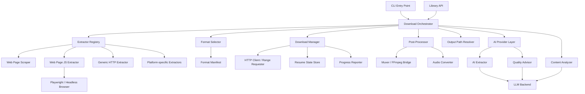
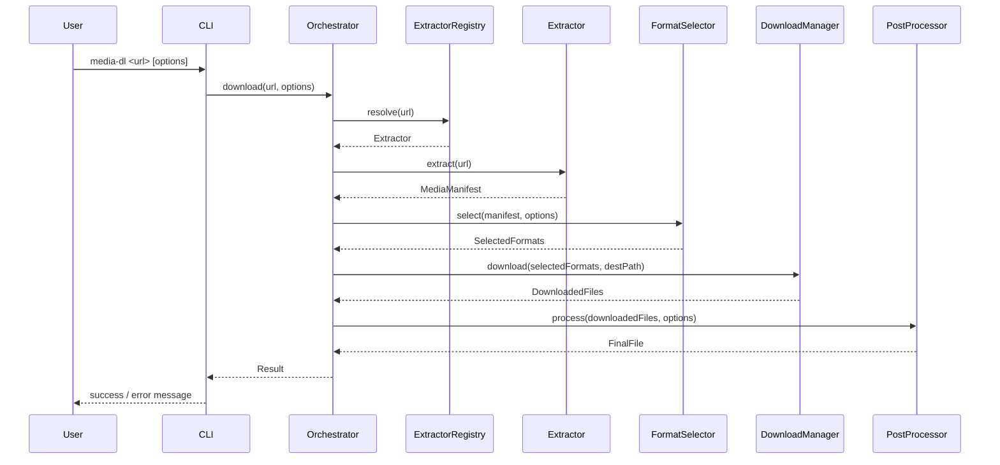
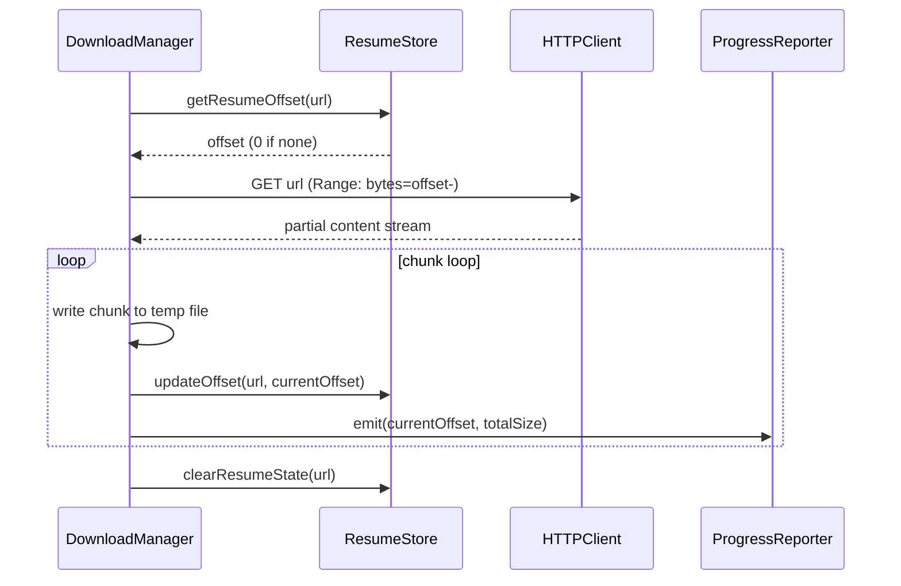
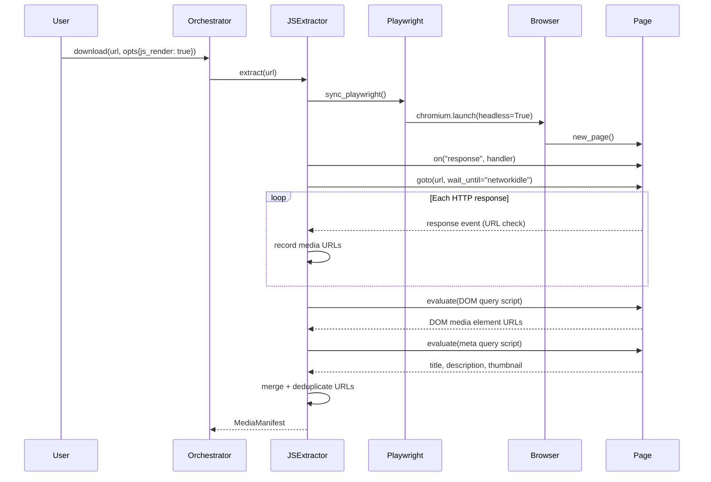
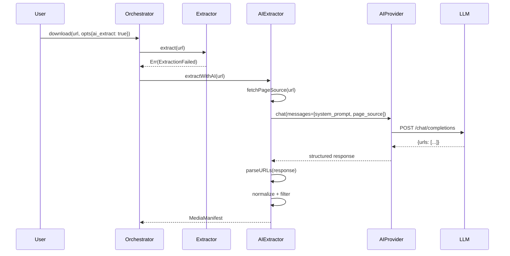
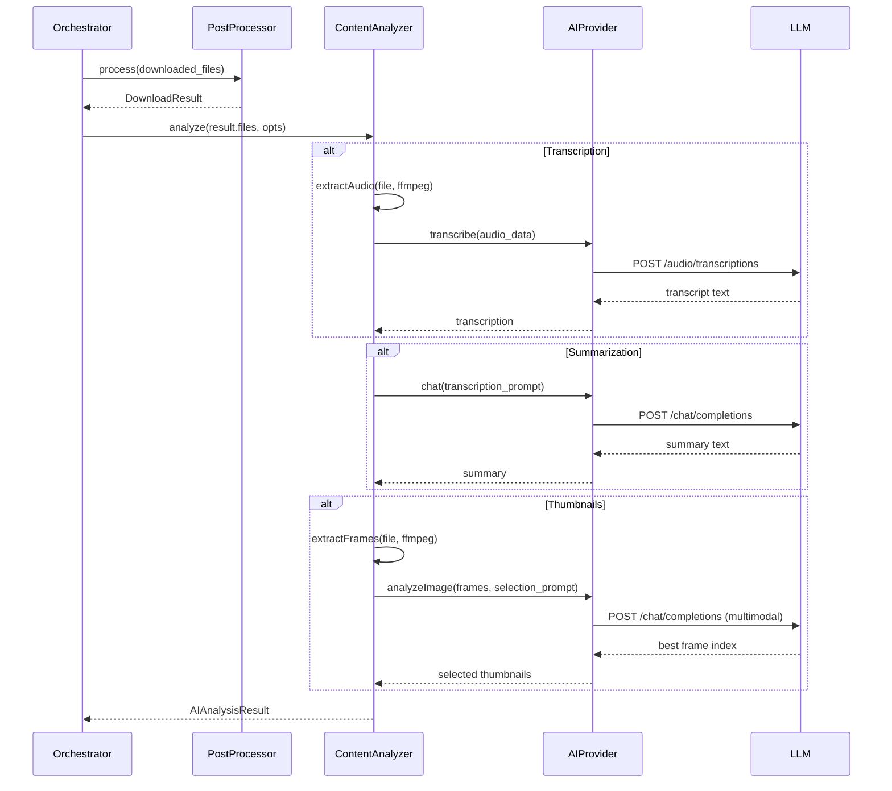

# Design Document: Media Downloader


## Overview

The media downloader is a CLI tool and reusable library for downloading video and audio files from internet sources (web pages, streaming platforms, direct media URLs). Given a URL, the tool identifies the media host, extracts available media streams and formats, selects the best match against user-specified quality constraints, downloads the stream(s), optionally merges video and audio tracks, and writes the final file to disk. The system is designed to be extensible: new platform extractors can be added without changing core download or merge logic.

The tool exposes both a command-line interface for end users and a programmatic API for integration into other applications. It supports resuming interrupted downloads, progress reporting, format selection, post-processing (audio extraction, remuxing), and configurable output naming. In addition to direct media URLs, the default extractor pipeline includes a lightweight web scraper for static HTML pages that surfaces media links embedded in the page. For JavaScript-heavy pages where media is loaded dynamically, an optional Playwright-based extractor can render the page in a headless browser and discover media through both DOM inspection and network request interception. The system also includes an optional AI layer that can reverse-engineer obfuscated media URLs, analyze downloaded content (transcription, summarization, thumbnails), and recommend optimal formats based on content type — all behind an abstract provider interface supporting OpenAI, Anthropic, and Ollama.

## Architecture



## Sequence Diagrams

### Main Download Flow



### Resumable Download Flow



### JS-Assisted Extraction Flow



### AI-Assisted Extraction Flow



### AI Content Analysis Flow



## Components and Interfaces

### Component 1: Download Orchestrator

**Purpose**: Central coordinator. Drives the full pipeline from URL input to final file on disk.

**Interface**:
```math
\begin{aligned}
&\text{Orchestrator} : \{\\
&\quad \text{download} : \text{URL} \times \text{DownloadOptions} \rightarrow \text{Result}(\text{DownloadResult}, \text{DownloadError})\\
&\quad \text{downloadBatch} : \text{URL}^{*} \times \text{DownloadOptions} \rightarrow \text{Result}(\text{DownloadResult}, \text{DownloadError})^{*}\\
&\}
\end{aligned}
```

**Responsibilities**:
- Resolve the correct extractor for a given URL
- Coordinate extraction → format selection → download → post-processing
- Handle top-level error recovery and retries
- Emit lifecycle events (start, progress, complete, error)

---

### Component 2: Extractor Registry

**Purpose**: Maintains the ordered list of platform extractors and resolves which one handles a given URL.

**Interface**:
```math
\begin{aligned}
&\text{ExtractorRegistry} : \{\\
&\quad \text{register} : \text{Extractor} \rightarrow \text{Unit}\\
&\quad \text{resolve} : \text{URL} \rightarrow \text{Option}(\text{Extractor})\\
&\quad \text{extractors} : \text{Extractor}^{*}\\
&\}
\end{aligned}
```

**Responsibilities**:
- Match URLs against each extractor's `canHandle` predicate (in registration order)
- Return the first matching extractor, or `None` if no extractor matches
- Allow runtime registration of additional extractors (plugin model)

---

### Component 3: Extractor (per-platform)

**Purpose**: Fetches the page/API for a given URL and returns a structured `MediaManifest` describing all available streams and metadata.

The default implementation now includes a `WebPageExtractor` for static HTML pages. It uses lightweight parsing to discover embedded media URLs from tags such as `video`, `audio`, `source`, `img`, and anchor links, plus common metadata properties such as `og:image` and `og:video`.

**Interface**:
```math
\begin{aligned}
&\text{Extractor} : \{\\
&\quad \text{canHandle} : \text{URL} \rightarrow \mathbb{B}\\
&\quad \text{extract} : \text{URL} \rightarrow \text{Result}(\text{MediaManifest}, \text{ExtractionError})\\
&\}
\end{aligned}
```

**Responsibilities**:
- Determine if a URL belongs to its platform (pattern matching)
- Fetch and parse the page or platform API
- Build and return a `MediaManifest` with all format streams

---

### Component 3b: Web Page JS Extractor

**Purpose**: Extracts media from JavaScript-rendered pages using a headless browser. Unlike the static `WebPageExtractor`, this component can discover media loaded dynamically via XHR/fetch/AJAX that never appears in the initial HTML.

This extractor is **never** auto-selected by the `ExtractorRegistry` — its `canHandle` always returns `False`. It is invoked directly by the orchestrator when the user passes `--js`. It uses two complementary strategies:

1. **DOM inspection** – queries the rendered DOM for `<video>`, `<audio>`, `<source>`, and `` elements using JavaScript evaluation.
2. **Network interception** – listens to all HTTP responses made by the page and records URLs matching known media extensions (`.mp4`, `.m3u8`, `.mpd`, `.ts`, etc.).

Both sources are merged, deduplicated, and normalized into a `MediaManifest`.

**Interface**:
```math
\begin{aligned}
&\text{WebPageJSExtractor} : \{\\
&\quad \text{canHandle} : \text{URL} \rightarrow \mathbb{B} \quad \text{(always } \bot\text{)}\\
&\quad \text{extract} : \text{URL} \rightarrow \text{Result}(\text{MediaManifest}, \text{ExtractionError})\\
&\}
\end{aligned}
```

**Responsibilities**:
- Launch a headless Chromium browser via Playwright
- Register a response listener before page navigation to capture all network requests
- Navigate to the target URL and wait for `networkidle` (no more than 30 s)
- Query the rendered DOM for media element `src`/`poster` attributes
- Parse `<title>` and OpenGraph meta tags for metadata
- Merge DOM-found and network-intercepted URLs, deduplicate, and filter to known media extensions
- Clean up the browser instance on completion or error

**Additional supported extensions** (beyond the static extractor):
- `.ts` — MPEG transport stream segments
- `.mpd` — DASH manifest

**Registration order**:
```
WebPageExtractor       (static, fast, default)
WebPageJSExtractor     (JS-capable, opt-in via --js, skipped by registry.resolve)
GenericHTTPExtractor   (direct media URLs)
```

---

### Component 4: Format Selector

**Purpose**: Given a `MediaManifest` and user quality preferences, returns the optimal set of streams to download.

**Interface**:
```math
\begin{aligned}
&\text{FormatSelector} : \{\\
&\quad \text{select} : \text{MediaManifest} \times \text{FormatOptions} \rightarrow \text{Result}(\text{SelectedFormats}, \text{SelectionError})\\
&\}
\end{aligned}
```

**Responsibilities**:
- Filter streams by type (video, audio, combined)
- Score streams against quality constraints (resolution, bitrate, codec preferences)
- Decide whether separate video+audio streams are needed (requires mux)
- Return selected stream(s) for download

---

### Component 5: Download Manager

**Purpose**: Performs the actual HTTP download of one or more stream URLs, with support for resuming, chunked transfer, and progress reporting.

**Interface**:
```math
\begin{aligned}
&\text{DownloadManager} : \{\\
&\quad \text{download} : \text{SelectedFormats} \times \text{Path} \rightarrow \text{Result}(\text{DownloadedFiles}, \text{DownloadError})\\
&\quad \text{cancel} : \text{Unit} \rightarrow \text{Unit}\\
&\}
\end{aligned}
```

**Responsibilities**:
- Issue HTTP range requests to support resume
- Persist resume state (byte offset) across restarts
- Write chunks to a temporary file and rename on completion
- Fire progress events for each chunk written

---

### Component 6: Post-Processor

**Purpose**: Transforms downloaded raw files into the final output (mux video+audio, extract audio, remux container).

**Interface**:
```math
\begin{aligned}
&\text{PostProcessor} : \{\\
&\quad \text{process} : \text{DownloadedFiles} \times \text{PostProcessOptions} \rightarrow \text{Result}(\text{FinalFile}, \text{ProcessingError})\\
&\}
\end{aligned}
```

**Responsibilities**:
- Detect whether muxing is needed (separate video + audio tracks)
- Invoke FFmpeg (or equivalent) for muxing/remuxing/conversion
- Clean up temporary files after processing
- Validate output file integrity

---

### Component 7: Output Path Resolver

**Purpose**: Converts a template string (e.g. `%(title)s.%(ext)s`) and `MediaManifest` metadata into a concrete file path.

**Interface**:
```math
\begin{aligned}
&\text{OutputPathResolver} : \{\\
&\quad \text{resolve} : \text{OutputTemplate} \times \text{MediaManifest} \rightarrow \text{Path}\\
&\}
\end{aligned}
```

**Responsibilities**:
- Substitute template variables with metadata fields
- Sanitize resulting filename for the target OS
- Ensure no path collisions (append index if needed)

---

### Component 8: AI Provider Abstraction

**Purpose**: Abstract interface for communicating with LLM backends. Supports multiple providers behind a uniform interface, with lazy SDK imports so that AI features are only loaded when explicitly enabled.

**Interface**:
```math
\begin{aligned}
&\text{AIProvider} : \{\\
&\quad \text{chat} : \text{List(Message)} \times \text{Option(String)} \rightarrow \text{String}\\
&\quad \text{analyzeImage} : \text{Path} \times \text{String} \rightarrow \text{String}\\
&\}
\end{aligned}
```

**AIConfig**:
```math
\begin{aligned}
&\text{AIConfig} : \{\\
&\quad \text{provider} : \text{String} \quad // "openai" | "anthropic" | "ollama"\\
&\quad \text{model} : \text{Option(String)}\\
&\quad \text{api\_key} : \text{Option(String)}\\
&\quad \text{base\_url} : \text{Option(String)}\\
&\quad \text{max\_tokens} : \mathbb{N}\\
&\quad \text{temperature} : \mathbb{R}\\
&\}
\end{aligned}
```

**Provider Implementations**:
- **OpenAIProvider**: Uses `openai` SDK. Sends chat completions to `POST /v1/chat/completions`. Image analysis via `gpt-4o` multimodal endpoint.
- **AnthropicProvider**: Uses `anthropic` SDK. Sends messages to `POST /v1/messages`. Image analysis via native multimodal support.
- **OllamaProvider**: Uses `ollama` Python client or raw HTTP to `localhost:11434`. Chat via `/api/chat`. Image analysis via `/api/chat` with images field.
- **Factory**: `create_provider(config) -> AIProvider` — dispatches on `config.provider` string, validates credentials, raises `AIConfigError` on unknown provider.

**Responsibilities**:
- Manage authentication (API keys, OAuth tokens)
- Construct provider-specific request payloads from generic message format
- Parse provider-specific responses into plain text
- Retry with exponential backoff on transient errors (429, 503)
- Enforce token budget (`max_tokens`) per request

---

### Component 9: AI Extractor

**Purpose**: Fallback extractor that uses an LLM to reverse-engineer obfuscated media URLs from page source. Invoked by the orchestrator when standard extraction fails and `opts.ai_extract` is `True`.

**Interface**:
```math
\begin{aligned}
&\text{AIExtractor} : \{\\
&\quad \text{can\_handle} : \text{URL} \rightarrow \mathbf{false}\\
&\quad \text{extractWithAI} : \text{URL} \rightarrow \text{Result}(\text{MediaManifest}, \text{ExtractionError})\\
&\}
\end{aligned}
```

**Responsibilities**:
- Fetch the full page source (HTML or rendered DOM) from the target URL
- Construct a structured prompt requesting JSON-formatted media URL list with metadata (quality, container, codec, type)
- Send prompt to AIProvider.chat() and parse the response
- Validate each returned URL against `_looks_like_media()` predicates
- Normalize valid URLs through the existing URL normalization pipeline
- Build and return a `MediaManifest` from the extracted candidates
- Return `ExtractionError` if the LLM produces no valid URLs

---

### Component 10: Content Analyzer

**Purpose**: Post-download content analysis using AI. Extracts audio for transcription, generates summaries, and selects representative thumbnails.

**Interface**:
```math
\begin{aligned}
&\text{ContentAnalyzer} : \{\\
&\quad \text{analyze} : \text{DownloadedFiles} \times \text{DownloadOptions} \rightarrow \text{AIAnalysisResult}\\
&\}
\end{aligned}
```

**Analysis Modes** (each independently opt-in via `DownloadOptions` flags):

| Mode | Flag | Input | Output | Provider Method |
|------|------|-------|--------|----------------|
| Transcription | `ai_transcribe` | Audio track (extracted via FFmpeg) | SRT/VTT text | STT endpoint or local Whisper |
| Summarization | `ai_summarize` | Transcription text | Markdown summary | `chat()` with summarization prompt |
| Thumbnails | `ai_thumbnails` | Video file | List of JPEG paths | Frame extraction (FFmpeg) + optional multimodal selection |

**Responsibilities**:
- Extract audio track from video using FFmpeg (if transcription requested)
- Chunk large audio files for STT API limits (25 MB per request)
- Generate SRT-format captions with timestamps
- Summarize transcript into structured markdown (key points, sections)
- Extract representative frames at uniform intervals using FFmpeg
- Optionally use multimodal LLM to select the most representative frame
- Return partial results if any individual mode fails (graceful degradation)

---

### Component 11: Quality Advisor

**Purpose**: Content-aware quality selection using AI. Classifies content type from manifest metadata and recommends the optimal format for that content.

**Interface**:
```math
\begin{aligned}
&\text{QualityAdvisor} : \{\\
&\quad \text{advise} : \text{MediaManifest} \times \text{AIConfig} \rightarrow \text{AIQualityAdvice}\\
&\}
\end{aligned}
```

**Content Type Classification**:

| Content Type | Heuristic Signals | Recommended Format |
|---|---|---|
| `lecture` | Duration > 20 min, educational keywords in title/description | 720p video + highest bitrate audio |
| `music_video` | Duration 2-8 min, music-related keywords | Max resolution video + max bitrate audio |
| `podcast` | Audio-only streams present, duration > 15 min | Audio-only (best bitrate) |
| `short_clip` | Duration < 60 s | Combined video+audio at moderate quality |
| `archival` | No strong signals, or user explicitly requests | Max resolution + max bitrate everything |

**Responsibilities**:
- Build a metadata summary from the manifest (durations, available resolutions, audio tracks, title, description)
- Send classification prompt to LLM with content signals
- Parse LLM response into content type and recommended format ID
- Fall back to `BestQualitySpec` if LLM fails or content type is ambiguous
- Cache recommendations for the same URL within a session

## Data Models

### Model 1: MediaManifest

Represents all available streams and metadata extracted from a URL.

```math
\begin{aligned}
&\text{MediaManifest} = \{\\
&\quad \text{id} : \text{String},\\
&\quad \text{title} : \text{String},\\
&\quad \text{description} : \text{Option}(\text{String}),\\
&\quad \text{uploader} : \text{Option}(\text{String}),\\
&\quad \text{duration} : \text{Option}(\mathbb{N}), \quad \text{// seconds}\\
&\quad \text{thumbnail} : \text{Option}(\text{URL}),\\
&\quad \text{formats} : \text{Format}^{+}, \quad \text{// non-empty list}\\
&\quad \text{extractedAt} : \text{Timestamp}\\
&\}
\end{aligned}
```

**Validation Rules**:
- `id` must be non-empty
- `formats` must contain at least one element
- `duration` must be positive if present

---

### Model 2: Format

Describes a single downloadable stream.

```math
\begin{aligned}
&\text{Format} = \{\\
&\quad \text{formatId} : \text{String},\\
&\quad \text{url} : \text{URL},\\
&\quad \text{streamType} : \text{StreamType}, \quad \text{StreamType} = \text{VideoOnly} | \text{AudioOnly} | \text{Combined}\\
&\quad \text{container} : \text{String}, \quad \text{// e.g. "mp4", "webm", "m4a"}\\
&\quad \text{codec} : \text{Option}(\text{String}),\\
&\quad \text{width} : \text{Option}(\mathbb{N}),\\
&\quad \text{height} : \text{Option}(\mathbb{N}),\\
&\quad \text{fps} : \text{Option}(\mathbb{R}),\\
&\quad \text{audioBitrate} : \text{Option}(\mathbb{N}), \quad \text{// kbps}\\
&\quad \text{videoBitrate} : \text{Option}(\mathbb{N}), \quad \text{// kbps}\\
&\quad \text{fileSize} : \text{Option}(\mathbb{N}), \quad \text{// bytes}\\
&\quad \text{isHLS} : \mathbb{B},\\
&\quad \text{isDASH} : \mathbb{B}\\
&\}
\end{aligned}
```

---

### Model 3: DownloadOptions

User-supplied configuration for a download request.

```math
\begin{aligned}
&\text{DownloadOptions} = \{\\
&\quad \text{quality} : \text{QualitySpec}, \quad \text{QualitySpec} = \text{Best} | \text{Worst} | \text{Height}(\mathbb{N}) | \text{FormatId}(\text{String}) | \text{AIRecommended}\\
&\quad \text{audioOnly} : \mathbb{B},\\
&\quad \text{audioFormat} : \text{Option}(\text{String}), \quad \text{// e.g. "mp3", "m4a"}\\
&\quad \text{outputTemplate} : \text{OutputTemplate},\\
&\quad \text{outputDir} : \text{Path},\\
&\quad \text{rateLimit} : \text{Option}(\mathbb{N}), \quad \text{// bytes/sec}\\
&\quad \text{retries} : \mathbb{N},\\
&\quad \text{resume} : \mathbb{B},\\
&\quad \text{concurrentFragments} : \mathbb{N},\\
&\quad \text{jsRender} : \mathbb{B}, \quad \text{// use Playwright for JS-rendered pages}\\
&\quad \text{aiExtract} : \mathbb{B}, \quad \text{// use AI to reverse-engineer obfuscated media URLs}\\
&\quad \text{aiQuality} : \mathbb{B}, \quad \text{// use AI to select optimal format for content type}\\
&\quad \text{aiAnalyze} : \mathbb{B}, \quad \text{// run all AI content analysis after download}\\
&\quad \text{aiTranscribe} : \mathbb{B}, \quad \text{// generate SRT captions via speech-to-text}\\
&\quad \text{aiSummarize} : \mathbb{B}, \quad \text{// generate a text summary}\\
&\quad \text{aiThumbnails} : \mathbb{B} \quad \text{// generate representative thumbnails}\\
&\}
\end{aligned}
```

---

### Model 4: SelectedFormats

The result of format selection — what will actually be downloaded.

```math
\begin{aligned}
&\text{SelectedFormats} = \{\\
&\quad \text{video} : \text{Option}(\text{Format}),\\
&\quad \text{audio} : \text{Option}(\text{Format}),\\
&\quad \text{requiresMux} : \mathbb{B} \quad \text{// true iff video} \neq \emptyset \land \text{audio} \neq \emptyset\\
&\}
\end{aligned}
```

**Invariant**: $\text{requiresMux} = (\text{video} \neq \emptyset \land \text{audio} \neq \emptyset)$

---

### Model 5: DownloadResult

Final outcome of a completed download operation.

```math
\begin{aligned}
&\text{DownloadResult} = \{\\
&\quad \text{finalPath} : \text{Path},\\
&\quad \text{manifest} : \text{MediaManifest},\\
&\quad \text{selectedFormats} : \text{SelectedFormats},\\
&\quad \text{bytesDownloaded} : \mathbb{N},\\
&\quad \text{durationMs} : \mathbb{N},\\
&\quad \text{analysis} : \text{Option}(\text{AIAnalysisResult})\\
&\}
\end{aligned}
```

---

### Model 6: ResumeState

Persisted state enabling interrupted downloads to continue.

```math
\begin{aligned}
&\text{ResumeState} = \{\\
&\quad \text{url} : \text{URL},\\
&\quad \text{tempPath} : \text{Path},\\
&\quad \text{bytesWritten} : \mathbb{N},\\
&\quad \text{totalSize} : \text{Option}(\mathbb{N}),\\
&\quad \text{etag} : \text{Option}(\text{String}),\\
&\quad \text{lastModified} : \text{Option}(\text{Timestamp})\\
&\}
\end{aligned}
```

---

### Model 7: AIConfig

Configuration for connecting to an AI provider. Read from environment variables or CLI flags.

```math
\begin{aligned}
&\text{AIConfig} = \{\\
&\quad \text{provider} : \text{String}, \quad \text{// "openai" | "anthropic" | "ollama"}\\
&\quad \text{model} : \text{Option}(\text{String}),\\
&\quad \text{apiKey} : \text{Option}(\text{String}),\\
&\quad \text{baseUrl} : \text{Option}(\text{String}),\\
&\quad \text{maxTokens} : \mathbb{N},\\
&\quad \text{temperature} : \mathbb{R}\\
&\}
\end{aligned}
```

---

### Model 8: AIAnalysisResult

Results from AI content analysis. Each field is optional — populated only when the corresponding analysis mode is enabled and succeeds.

```math
\begin{aligned}
&\text{AIAnalysisResult} = \{\\
&\quad \text{transcription} : \text{Option}(\text{String}), \quad \text{// SRT-formatted captions}\\
&\quad \text{summary} : \text{Option}(\text{String}), \quad \text{// markdown summary}\\
&\quad \text{thumbnails} : \text{List}(\text{Path}), \quad \text{// selected representative frames}\\
&\quad \text{contentType} : \text{Option}(\text{String}), \quad \text{// e.g. "lecture", "music\_video"}\\
&\quad \text{suggestedFormat} : \text{Option}(\text{String}) \quad \text{// recommended format ID}\\
&\}
\end{aligned}
```

---

### Model 9: AIQualityAdvice

Internal model returned by the Quality Advisor. Not user-facing — consumed by the Format Selector.

```math
\begin{aligned}
&\text{AIQualityAdvice} = \{\\
&\quad \text{contentType} : \text{String},\\
&\quad \text{recommendedFormatId} : \text{Option}(\text{String}),\\
&\quad \text{reasoning} : \text{String}\\
&\}
\end{aligned}
```

## Algorithmic Pseudocode

### Algorithm 1: Main Download Orchestration

```math
\begin{aligned}
&\textbf{algorithm } \text{orchestrate} \textbf{ is}\\
&\quad \textbf{input}: u \in \text{URL},\ opts \in \text{DownloadOptions}\\
&\quad \textbf{output}: r \in \text{Result}(\text{DownloadResult}, \text{DownloadError})\\
&\quad \textbf{precondition}: u \neq \emptyset \land \text{isValidURL}(u)\\
&\quad \textbf{postcondition}: r = \text{Ok}(d) \Rightarrow \text{fileExists}(d.\text{finalPath}) \land d.\text{bytesDownloaded} > 0\\
&\\
&\quad \textbf{if } opts.\text{jsRender} \textbf{ then}\\
&\quad\quad \text{extractor} \gets \text{WebPageJSExtractor()}\\
&\quad \textbf{else}\\
&\quad\quad \text{extractor} \gets \text{registry.resolve}(u)\\
&\quad\quad \textbf{if } \text{extractor} = \emptyset \textbf{ then return } \text{Err}(\text{NoExtractorFound}(u))\\
&\quad \textbf{end if}\\
&\\
&\quad \text{manifest} \gets \text{extractor.extract}(u)\\
&\quad \textbf{if } \text{manifest} = \text{Err}(e) \textbf{ then}\\
&\quad\quad \textbf{if } opts.\text{aiExtract} \textbf{ then}\\
&\quad\quad\quad \text{manifest} \gets \text{aiExtractor.extractWithAI}(u)\\
&\quad\quad \textbf{else}\\
&\quad\quad\quad \textbf{return } \text{Err}(\text{ExtractionFailed}(e))\\
&\quad\quad \textbf{end if}\\
&\quad\quad \textbf{if } \text{manifest} = \text{Err}(e2) \textbf{ then return } \text{Err}(\text{ExtractionFailed}(e2))\\
&\quad \textbf{end if}\\
&\\
&\quad \text{selected} \gets \text{formatSelector.select}(\text{manifest.value}, opts)\\
&\quad \textbf{if } \text{selected} = \text{Err}(e) \textbf{ then return } \text{Err}(\text{SelectionFailed}(e))\\
&\\
&\quad \text{destDir} \gets \text{outputResolver.resolve}(opts.\text{outputTemplate}, \text{manifest.value})\\
&\\
&\quad \text{files} \gets \text{downloadManager.download}(\text{selected.value}, \text{destDir})\\
&\quad \textbf{if } \text{files} = \text{Err}(e) \textbf{ then return } \text{Err}(\text{DownloadFailed}(e))\\
&\\
&\quad \text{final} \gets \text{postProcessor.process}(\text{files.value}, \text{toPostProcOpts}(opts))\\
&\quad \textbf{if } \text{final} = \text{Err}(e) \textbf{ then return } \text{Err}(\text{ProcessingFailed}(e))\\
&\\
&\quad \text{analysis} \gets \text{None}\\
&\quad \textbf{if } opts.\text{aiAnalyze} \textbf{ then}\\
&\quad\quad \text{analysis} \gets \text{contentAnalyzer.analyze}(\text{final.value}, opts)\\
&\quad \textbf{end if}\\
&\\
&\quad \textbf{return } \text{Ok}\Bigl(\{\\
&\quad\quad \text{finalPath}: \text{final.value.path},\ \text{manifest}: \text{manifest.value},\\
&\quad\quad \text{selectedFormats}: \text{selected.value},\ \text{bytesDownloaded}: \text{files.value.totalBytes},\\
&\quad\quad \text{durationMs}: \text{elapsed}(),\ \text{analysis}: \text{analysis}\\
&\quad \}\Bigr)
\end{aligned}
```

**Preconditions**:
- $u$ is a syntactically valid URL
- `registry` contains at least one registered extractor

**Postconditions**:
- On success: output file exists at `finalPath` with non-zero size
- On failure: no partial files are left in the output directory (cleaned up)

---

### Algorithm 2: Format Selection

```math
\begin{aligned}
&\textbf{algorithm } \text{selectFormats} \textbf{ is}\\
&\quad \textbf{input}: m \in \text{MediaManifest},\ opts \in \text{FormatOptions}\\
&\quad \textbf{output}: s \in \text{Result}(\text{SelectedFormats}, \text{SelectionError})\\
&\quad \textbf{precondition}: m.\text{formats} \neq \emptyset\\
&\quad \textbf{postcondition}: s = \text{Ok}(f) \Rightarrow (f.\text{video} \neq \emptyset \lor f.\text{audio} \neq \emptyset)\\
&\\
&\quad \textbf{if } opts.\text{formatId} \neq \emptyset \textbf{ then}\\
&\quad\quad f \gets m.\text{formats}[\text{opts.formatId}]\\
&\quad\quad \textbf{if } f = \emptyset \textbf{ then return } \text{Err}(\text{FormatIdNotFound})\\
&\quad\quad \textbf{return } \text{Ok}(\text{asSingleFormat}(f))\\
&\quad \textbf{end if}\\
&\\
&\quad \text{candidates} \gets \{ f \in m.\text{formats} \mid \text{matchesConstraints}(f, opts) \}\\
&\\
&\quad \textbf{if } opts.\text{audioOnly} \textbf{ then}\\
&\quad\quad \text{best} \gets \arg\max_{f \in \text{candidates},\ f.\text{streamType} \in \{\text{AudioOnly}, \text{Combined}\}} \text{audioScore}(f)\\
&\quad\quad \textbf{return } \text{Ok}(\{ \text{video}: \emptyset,\ \text{audio}: \text{best},\ \text{requiresMux}: \bot \})\\
&\quad \textbf{end if}\\
&\\
&\quad \text{combined} \gets \{ f \in \text{candidates} \mid f.\text{streamType} = \text{Combined} \}\\
&\quad \text{videoOnly} \gets \{ f \in \text{candidates} \mid f.\text{streamType} = \text{VideoOnly} \}\\
&\quad \text{audioOnly\_} \gets \{ f \in \text{candidates} \mid f.\text{streamType} = \text{AudioOnly} \}\\
&\\
&\quad \textbf{if } \text{combined} \neq \emptyset \textbf{ then}\\
&\quad\quad \text{best} \gets \arg\max_{f \in \text{combined}} \text{qualityScore}(f, opts)\\
&\quad\quad \textbf{return } \text{Ok}(\{ \text{video}: \text{best},\ \text{audio}: \emptyset,\ \text{requiresMux}: \bot \})\\
&\quad \textbf{else if } \text{videoOnly} \neq \emptyset \land \text{audioOnly\_} \neq \emptyset \textbf{ then}\\
&\quad\quad v \gets \arg\max_{f \in \text{videoOnly}} \text{videoScore}(f, opts)\\
&\quad\quad a \gets \arg\max_{f \in \text{audioOnly\_}} \text{audioScore}(f)\\
&\quad\quad \textbf{return } \text{Ok}(\{ \text{video}: v,\ \text{audio}: a,\ \text{requiresMux}: \top \})\\
&\quad \textbf{else}\\
&\quad\quad \textbf{return } \text{Err}(\text{NoSuitableFormatFound})\\
&\quad \textbf{end if}
\end{aligned}
```

**Preconditions**:
- $m.\text{formats} \neq \emptyset$
- $opts.\text{quality} \in \{\text{Best}, \text{Worst}, \text{Height}(n), \text{FormatId}(s)\}$

**Postconditions**:
- At least one of `video` or `audio` is non-empty in the result
- `requiresMux = true` iff both `video` and `audio` are present

---

### Algorithm 3: Resumable HTTP Download

```math
\begin{aligned}
&\textbf{algorithm } \text{downloadStream} \textbf{ is}\\
&\quad \textbf{input}: u \in \text{URL},\ \text{dest} \in \text{Path},\ opts \in \text{DownloadOptions}\\
&\quad \textbf{output}: r \in \text{Result}(\text{DownloadedFile}, \text{DownloadError})\\
&\quad \textbf{precondition}: u \neq \emptyset \land \text{isAccessible}(\text{dest.parent})\\
&\quad \textbf{postcondition}: r = \text{Ok}(f) \Rightarrow f.\text{size} = \text{totalSize} \land \text{fileIntact}(f.\text{path})\\
&\\
&\quad \text{offset} \gets \textbf{if } opts.\text{resume} \textbf{ then } \text{resumeStore.get}(u).\text{bytesWritten} \textbf{ else } 0\\
&\quad \text{resp} \gets \text{http.get}(u, \text{headers}: \{\text{"Range"}: \text{"bytes="\!+\!offset\!+\!"-"}\})\\
&\quad \textbf{if } \text{resp.status} \notin \{200, 206\} \textbf{ then return } \text{Err}(\text{HTTPError}(\text{resp.status}))\\
&\\
&\quad \text{totalSize} \gets \text{parseContentLength}(\text{resp.headers}) + \text{offset}\\
&\quad \text{tempPath} \gets \text{dest} + \text{".part"}\\
&\quad \text{file} \gets \text{openAppend}(\text{tempPath})\\
&\\
&\quad \text{written} \gets \text{offset}\\
&\quad \textbf{for each } \text{chunk} \in \text{resp.bodyChunks} \textbf{ do}\\
&\quad\quad \quad \textbf{invariant}: \text{written} \leq \text{totalSize} \land \text{fileConsistent}(\text{tempPath}, \text{written})\\
&\quad\quad \text{applyRateLimit}(opts.\text{rateLimit})\\
&\quad\quad \text{file.write}(\text{chunk})\\
&\quad\quad \text{written} \gets \text{written} + |\text{chunk}|\\
&\quad\quad \text{resumeStore.update}(u, \text{written})\\
&\quad\quad \text{progress.emit}(\text{written}, \text{totalSize})\\
&\quad \textbf{end for}\\
&\\
&\quad \text{file.close}()\\
&\quad \text{rename}(\text{tempPath}, \text{dest})\\
&\quad \text{resumeStore.clear}(u)\\
&\quad \textbf{return } \text{Ok}(\{ \text{path}: \text{dest},\ \text{size}: \text{written} \})
\end{aligned}
```

**Preconditions**:
- The URL is reachable and responds with HTTP 200 or 206
- The destination parent directory exists and is writable

**Postconditions**:
- On success: `.part` temp file is removed; final file size equals `totalSize`
- Resume state is cleared upon successful completion

**Loop Invariant**:
- $\text{written} \leq \text{totalSize}$
- The `.part` file on disk is byte-for-byte consistent with the first `written` bytes of the stream

---

### Algorithm 4: URL Extractor Resolution

```math
\begin{aligned}
&\textbf{algorithm } \text{resolveExtractor} \textbf{ is}\\
&\quad \textbf{input}: u \in \text{URL},\ E = [e_1, e_2, \ldots, e_n] \in \text{Extractor}^{*}\\
&\quad \textbf{output}: x \in \text{Option}(\text{Extractor})\\
&\quad \textbf{precondition}: u \neq \emptyset\\
&\quad \textbf{postcondition}: x = \text{Some}(e) \Rightarrow e.\text{canHandle}(u) = \top\\
&\\
&\quad i \gets 1\\
&\quad \textbf{while } i \leq n \textbf{ do}\\
&\quad\quad \textbf{invariant}: \forall j < i,\ e_j.\text{canHandle}(u) = \bot\\
&\quad\quad \textbf{if } e_i.\text{canHandle}(u) \textbf{ then return } \text{Some}(e_i)\\
&\quad\quad i \gets i + 1\\
&\quad \textbf{end while}\\
&\quad \textbf{return } \text{None}
\end{aligned}
```

**Loop Invariant**: All extractors at indices $< i$ have been checked and do not handle $u$.

---

### Algorithm 5: JS-Assisted Media Extraction

```math
\begin{aligned}
&\textbf{algorithm } \text{extractJS} \textbf{ is}\\
&\quad \textbf{input}: u \in \text{URL}\\
&\quad \textbf{output}: m \in \text{Result}(\text{MediaManifest}, \text{ExtractionError})\\
&\quad \textbf{precondition}: u \neq \emptyset \land \text{Playwright available}\\
&\quad \textbf{postcondition}: m = \text{Ok}(\hat{m}) \Rightarrow |\hat{m}.\text{formats}| \geq 1\\
&\\
&\quad \text{pw} \gets \text{sync\_playwright()}\\
&\quad \text{browser} \gets \text{pw.chromium.launch}(\text{headless}: \top)\\
&\quad \text{page} \gets \text{browser.newPage()}\\
&\\
&\quad \text{networkUrls} \gets \emptyset\\
&\quad \text{page.on}(\text{"response"},\ \lambda\ r.\ \text{if } \text{isMediaURL}(r.\text{url}) \text{ then } \text{networkUrls} \gets \text{networkUrls} \cup \{r.\text{url}\})\\
&\\
&\quad \text{page.goto}(u,\ \text{waitUntil}: \text{"networkidle"},\ \text{timeout}: 30000)\\
&\\
&\quad \text{domUrls} \gets \text{page.evaluate}(\text{DOM query script})\\
&\quad \text{title} \gets \text{page.title()}\\
&\quad \text{meta} \gets \text{page.evaluate}(\text{Meta query script})\\
&\\
&\quad \text{browser.close()}\\
&\\
&\quad \text{allRaw} \gets \text{domUrls} \cup \text{networkUrls}\\
&\quad \text{candidates} \gets \text{normalizeAndFilter}(u,\ \text{allRaw})\\
&\quad \textbf{if } \text{candidates} = \emptyset \textbf{ then return } \text{Err}(\text{NoMediaFound}(u))\\
&\\
&\quad \textbf{return } \text{Ok}(\text{buildManifest}(u,\ \text{candidates},\ \text{title},\ \text{meta}))
\end{aligned}
```

**Preconditions**:
- Playwright is installed and browser binaries are available
- The target URL is reachable

**Postconditions**:
- On success: manifest contains at least one format
- Browser process is terminated regardless of success/failure

**Network Interception Invariant**:
- The response listener is registered *before* `page.goto()` to ensure no media responses are missed during initial page load.

---

### Algorithm 6: Format Quality Scoring

```math
\begin{aligned}
&\textbf{algorithm } \text{qualityScore} \textbf{ is}\\
&\quad \textbf{input}: f \in \text{Format},\ opts \in \text{FormatOptions}\\
&\quad \textbf{output}: s \in \mathbb{R}\\
&\quad \textbf{precondition}: f \neq \emptyset\\
&\\
&\quad h \gets f.\text{height} \text{ if } f.\text{height} \neq \emptyset \text{ else } 0\\
&\quad vb \gets f.\text{videoBitrate} \text{ if } f.\text{videoBitrate} \neq \emptyset \text{ else } 0\\
&\quad ab \gets f.\text{audioBitrate} \text{ if } f.\text{audioBitrate} \neq \emptyset \text{ else } 0\\
&\\
&\quad \textbf{match } opts.\text{quality} \textbf{ with}\\
&\quad | \text{Best} \Rightarrow s \gets h \times 10000 + vb + ab\\
&\quad | \text{Worst} \Rightarrow s \gets -(h \times 10000 + vb + ab)\\
&\quad | \text{Height}(target) \Rightarrow s \gets -|h - target|\\
&\quad \textbf{return } s
\end{aligned}
```

---

### Algorithm 7: AI-Assisted Extraction

```math
\begin{aligned}
&\textbf{algorithm } \text{extractAI} \textbf{ is}\\
&\quad \textbf{input}: u \in \text{URL},\ src \in \text{String},\ config \in \text{AIConfig}\\
&\quad \textbf{output}: r \in \text{Result}(\text{MediaManifest}, \text{ExtractionError})\\
&\quad \textbf{precondition}: \text{isValidURL}(u) \land \text{providerReachable}(config)\\
&\quad \textbf{postcondition}: r = \text{Ok}(m) \Rightarrow m.\text{formats} \neq \emptyset\\
&\\
&\quad \text{systemPrompt} \gets \text{"You are a media URL extraction assistant.}\\
&\quad\quad \text{Given the following web page source, identify all media URLs"}\\
&\quad\quad \text{(video/audio). Return JSON: \{urls: [\{url, type, quality,}\\
&\quad\quad \text{container, codec\}\]\}. Only include playable media."}\\
&\\
&\quad \text{messages} \gets [\{\text{role}: \text{"system"},\ \text{content}: \text{systemPrompt}\},\\
&\quad\quad\quad\quad\quad\ \{\text{role}: \text{"user"},\ \text{content}: \text{src}\}]\\
&\\
&\quad \text{response} \gets \text{config.provider.chat}(\text{messages})\\
&\quad \textbf{if } \text{response} = \text{Err}(e) \textbf{ then return } \text{Err}(\text{AIFailure}(e))\\
&\\
&\quad \text{candidates} \gets \text{parseJSON}(\text{response.value})\\
&\quad \textbf{if } \text{candidates} = \text{None} \textbf{ then return } \text{Err}(\text{ParseError}(\text{"unparseable AI response"}))\\
&\\
&\quad \text{valid} \gets \text{filter}(\text{candidates},\ \lambda c.\ \text{\_looks\_like\_media}(c.\text{url}))\\
&\quad \textbf{if } |\text{valid}| = 0 \textbf{ then return } \text{Err}(\text{ExtractionError}(\text{"no valid media URLs found"}))\\
&\\
&\quad \text{normalized} \gets \text{map}(\text{valid},\ \lambda c.\ \text{normalizeToFormat}(c))\\
&\quad \textbf{return } \text{Ok}\Bigl(\{\\
&\quad\quad \text{id}: \text{generateId}(u),\ \text{sourceUrl}: u,\\
&\quad\quad \text{title}: \text{extractTitle}(\text{src}),\\
&\quad\quad \text{formats}: \text{normalized},\\
&\quad\quad \text{duration}: \text{None}\\
&\quad \}\Bigr)
\end{aligned}
```

---

### Algorithm 8: Content-Aware Quality Scoring

```math
\begin{aligned}
&\textbf{algorithm } \text{adviseQuality} \textbf{ is}\\
&\quad \textbf{input}: m \in \text{MediaManifest},\ config \in \text{AIConfig}\\
&\quad \textbf{output}: a \in \text{AIQualityAdvice}\\
&\quad \textbf{precondition}: m.\text{formats} \neq \emptyset\\
&\\
&\quad \text{metadata} \gets \text{buildMetadataSummary}(m)\\
&\quad\quad \text{// includes: title, description, duration, available resolutions,}\\
&\quad\quad \text{// available audio bitrates, container types}\\
&\\
&\quad \text{prompt} \gets \text{"Classify this media content type and recommend}\\
&\quad\quad \text{optimal format. Content types: lecture, music\_video, podcast,}\\
&\quad\quad \text{short\_clip, archival. Return JSON: \{content\_type,}\\
&\quad\quad \text{recommended\_format\_id, reasoning\}. Metadata: " } \cup \text{metadata}\\
&\\
&\quad \text{messages} \gets [\{\text{role}: \text{"system"},\ \text{content}: \text{prompt}\}]\\
&\quad \text{response} \gets \text{config.provider.chat}(\text{messages})\\
&\\
&\quad \textbf{if } \text{response} = \text{Err}(e) \textbf{ then}\\
&\quad\quad \textbf{return } \{\\
&\quad\quad\quad \text{contentType}: \text{"unknown"},\\
&\quad\quad\quad \text{recommendedFormatId}: \text{None},\\
&\quad\quad\quad \text{reasoning}: \text{"AI unavailable, falling back to best quality"}\\
&\quad\quad \}\\
&\quad \textbf{end if}\\
&\\
&\quad \text{parsed} \gets \text{parseJSON}(\text{response.value})\\
&\quad \textbf{return } \{\\
&\quad\quad \text{contentType}: \text{parsed.content\_type},\\
&\quad\quad \text{recommendedFormatId}: \text{parsed.recommended\_format\_id},\\
&\quad\quad \text{reasoning}: \text{parsed.reasoning}\\
&\quad \}
\end{aligned}
```

---

### Algorithm 9: Content Analysis

```math
\begin{aligned}
&\textbf{algorithm } \text{analyzeContent} \textbf{ is}\\
&\quad \textbf{input}: f \in \text{DownloadedFiles},\ config \in \text{AIConfig},\ opts \in \text{DownloadOptions}\\
&\quad \textbf{output}: r \in \text{AIAnalysisResult}\\
&\\
&\quad \text{result} \gets \{\text{transcription}: \text{None},\ \text{summary}: \text{None},\ \text{thumbnails}: [],\\
&\quad\quad\quad\quad\ \ \text{contentType}: \text{None},\ \text{suggestedFormat}: \text{None}\}\\
&\\
&\quad \textbf{if } opts.\text{aiTranscribe} \textbf{ then}\\
&\quad\quad \text{audio} \gets \text{ffmpeg.extractAudio}(f.\text{videoPath})\\
&\quad\quad \text{audioChunks} \gets \text{chunkAudio}(\text{audio},\ 25\text{MB})\\
&\quad\quad \text{transcripts} \gets []\\
&\quad\quad \textbf{for each } \text{chunk} \in \text{audioChunks} \textbf{ do}\\
&\quad\quad\quad \text{t} \gets \text{config.provider.transcribe}(\text{chunk})\\
&\quad\quad\quad \text{transcripts}.append(\text{t})\\
&\quad\quad \textbf{end for}\\
&\quad\quad \text{result.transcription} \gets \text{mergeTranscripts}(\text{transcripts})\\
&\quad\quad \text{writeSRT}(\text{result.transcription},\ f.\text{videoPath}.withSuffix(\text{".srt"}))\\
&\quad \textbf{end if}\\
&\\
&\quad \textbf{if } opts.\text{aiSummarize} \land \text{result.transcription} \neq \text{None} \textbf{ then}\\
&\quad\quad \text{prompt} \gets \text{"Summarize this transcript. Include key points,}\\
&\quad\quad\quad \text{sections, and timestamps. Format as markdown."}\\
&\quad\quad \text{messages} \gets [\{\text{role}: \text{"user"},\ \text{content}: \text{prompt} \cup \text{result.transcription}\}]\\
&\quad\quad \text{result.summary} \gets \text{config.provider.chat}(\text{messages})\\
&\quad \textbf{end if}\\
&\\
&\quad \textbf{if } opts.\text{aiThumbnails} \textbf{ then}\\
&\quad\quad \text{frames} \gets \text{ffmpeg.extractFrames}(f.\text{videoPath},\ \text{interval}=10\text{s})\\
&\quad\quad \textbf{if } |\text{frames}| > 5 \textbf{ then}\\
&\quad\quad\quad \text{prompt} \gets \text{"Select the 3 most representative frames}\\
&\quad\quad\quad\quad \text{for a video thumbnail. Return indices."}\\
&\quad\quad\quad \text{selected} \gets \text{config.provider.selectFrames}(\text{frames},\ \text{prompt})\\
&\quad\quad\quad \text{result.thumbnails} \gets \text{saveThumbnails}(\text{frames}[\text{selected}])\\
&\quad\quad \textbf{else}\\
&\quad\quad\quad \text{result.thumbnails} \gets \text{saveThumbnails}(\text{frames}[:3])\\
&\quad\quad \textbf{end if}\\
&\quad \textbf{end if}\\
&\\
&\quad \textbf{return } \text{result}
\end{aligned}
```

## Key Functions with Formal Specifications

### Function 1: `extract(url)`

```math
\text{extract} : \text{URL} \rightarrow \text{Result}(\text{MediaManifest}, \text{ExtractionError})
```

**Preconditions**:
- $url \neq \emptyset$
- Network is reachable; the platform at $url$ is accessible

**Postconditions**:
- $\text{Ok}(m) \Rightarrow m.\text{formats} \neq \emptyset \land m.\text{id} \neq \emptyset$
- $\text{Err}(e) \Rightarrow e \in \{\text{NetworkError}, \text{ParseError}, \text{GeoBlocked}, \text{NotFound}\}$

---

### Function 2: `select(manifest, opts)`

```math
\text{select} : \text{MediaManifest} \times \text{FormatOptions} \rightarrow \text{Result}(\text{SelectedFormats}, \text{SelectionError})
```

**Preconditions**:
- $manifest.\text{formats} \neq \emptyset$
- $opts.\text{quality} \in \text{QualitySpec}$

**Postconditions**:
- $\text{Ok}(s) \Rightarrow (s.\text{video} \neq \emptyset \lor s.\text{audio} \neq \emptyset)$
- $\text{Ok}(s) \Rightarrow s.\text{requiresMux} = (s.\text{video} \neq \emptyset \land s.\text{audio} \neq \emptyset)$
- $\text{Err}(e) \Rightarrow \text{no format in manifest satisfies constraints}$

---

### Function 3: `download(selectedFormats, dest)`

```math
\text{download} : \text{SelectedFormats} \times \text{Path} \rightarrow \text{Result}(\text{DownloadedFiles}, \text{DownloadError})
```

**Preconditions**:
- At least one of `selectedFormats.video` or `selectedFormats.audio` is non-empty
- `dest` directory is writable

**Postconditions**:
- $\text{Ok}(files) \Rightarrow \forall f \in files,\ \text{fileExists}(f.\text{path}) \land f.\text{size} > 0$
- On failure: all temporary `.part` files are cleaned up

**Loop Invariant** (chunk write loop):
- `written ≤ totalSize`
- The `.part` file on disk matches the first `written` bytes of the remote stream

---

### Function 4: `process(files, opts)`

```math
\text{process} : \text{DownloadedFiles} \times \text{PostProcessOptions} \rightarrow \text{Result}(\text{FinalFile}, \text{ProcessingError})
```

**Preconditions**:
- All files in `DownloadedFiles` exist and have non-zero size
- FFmpeg is available if `requiresMux = true`

**Postconditions**:
- $\text{Ok}(f) \Rightarrow \text{fileExists}(f.\text{path}) \land \text{validMediaFile}(f.\text{path})$
- Intermediate downloaded files are deleted after successful mux
- On failure: original downloaded files are preserved (no data loss)

---

### Function 5: `resolve(template, manifest)`

```math
\text{resolve} : \text{OutputTemplate} \times \text{MediaManifest} \rightarrow \text{Path}
```

**Preconditions**:
- `template` is a non-empty string
- `manifest` contains all fields referenced in `template`

**Postconditions**:
- Returned path has no illegal filesystem characters
- Returned path is unique within the output directory

---

### Function 6: `extractAI(url, source, config)`

```math
\text{extractAI} : \text{URL} \times \text{String} \times \text{AIConfig} \rightarrow \text{Result}(\text{MediaManifest}, \text{ExtractionError})
```

**Preconditions**:
- $url$ is a syntactically valid URL
- `config.provider` is reachable and authenticated
- `source` is the full HTML or rendered DOM of the page at $url$

**Postconditions**:
- $\text{Ok}(m) \Rightarrow m.\text{formats} \neq \emptyset \land \forall f \in m.\text{formats}.\ \text{\_looks\_like\_media}(f.\text{url})$
- $\text{Err}(e) \Rightarrow e \in \{\text{NetworkError}, \text{AIFailure}, \text{ParseError}\}$

---

### Function 7: `adviseQuality(manifest, config)`

```math
\text{adviseQuality} : \text{MediaManifest} \times \text{AIConfig} \rightarrow \text{AIQualityAdvice}
```

**Preconditions**:
- $manifest.\text{formats} \neq \emptyset$
- `config.provider` is reachable

**Postconditions**:
- Always returns a valid `AIQualityAdvice` (never raises — falls back to "unknown" on failure)
- $\text{advice.content\_type} \in \{\text{"lecture"}, \text{"music\_video"}, \text{"podcast"}, \text{"short\_clip"}, \text{"archival"}, \text{"unknown"}\}$

---

### Function 8: `analyzeContent(files, config, opts)`

```math
\text{analyzeContent} : \text{DownloadedFiles} \times \text{AIConfig} \times \text{DownloadOptions} \rightarrow \text{AIAnalysisResult}
```

**Preconditions**:
- `files` contains at least one valid downloaded file
- At least one of `opts.aiTranscribe`, `opts.aiSummarize`, `opts.aiThumbnails` is $\top$

**Postconditions**:
- Always returns a valid `AIAnalysisResult` (partial results on individual mode failures)
- $\text{result.transcription} \neq \text{None} \Rightarrow \text{validSRTFormat}(\text{result.transcription})$
- $\text{result.thumbnails} \neq [] \Rightarrow \forall p \in \text{result.thumbnails}.\ \text{fileExists}(p)$

## Example Usage

```math
\begin{aligned}
&\textbf{// Basic video download}\\
&\textbf{let } u = \text{"https://example-video-site.com/watch?v=abc123"}\\
&\textbf{let } opts = \{\\
&\quad \text{quality}: \text{Best},\ \text{audioOnly}: \bot,\ \text{audioFormat}: \emptyset,\\
&\quad \text{outputTemplate}: \text{"%(title)s.%(ext)s"},\ \text{outputDir}: \text{"./downloads"},\\
&\quad \text{retries}: 3,\ \text{resume}: \top,\ \text{concurrentFragments}: 4\\
&\}\\
&\textbf{let } r = \text{orchestrator.download}(u, opts)\\
&\textbf{match } r \textbf{ with}\\
&\quad | \text{Ok}(d) \rightarrow \text{print}(\text{"Saved to: "} + d.\text{finalPath})\\
&\quad | \text{Err}(e) \rightarrow \text{print}(\text{"Error: "} + e.\text{message})\\
&\\
&\textbf{// Audio-only extraction}\\
&\textbf{let } opts_a = opts \cup \{ \text{audioOnly}: \top,\ \text{audioFormat}: \text{"mp3"} \}\\
&\textbf{let } r_a = \text{orchestrator.download}(u, opts_a)\\
&\\
&\textbf{// Specific quality}\\
&\textbf{let } opts_q = opts \cup \{ \text{quality}: \text{Height}(1080) \}\\
&\textbf{let } r_q = \text{orchestrator.download}(u, opts_q)\\
&\\
&\textbf{// Batch download}\\
&\textbf{let } urls = [u_1, u_2, u_3]\\
&\textbf{let } results = \text{orchestrator.downloadBatch}(urls, opts)\\
&\forall i,\ results[i] = \text{Ok}(\cdot) \lor results[i] = \text{Err}(\cdot) \quad \textbf{// each independent}\\
&\\
&\textbf{// JS-rendered page}\\
&\textbf{let } opts_js = opts \cup \{ \text{jsRender}: \top \}\\
&\textbf{let } r_js = \text{orchestrator.download}(u_{\text{spa}}, opts_js)
\end{aligned}
```

```math
\begin{aligned}
&\textbf{// AI-assisted extraction (obfuscated pages)}\\
&\textbf{let } opts_{ai} = opts \cup \{ \text{aiExtract}: \top \}\\
&\textbf{let } r_{ai} = \text{orchestrator.download}(u_{\text{obfuscated}}, opts_{ai})\\
&\textbf{// Falls back to LLM-based URL extraction on ExtractionFailed}\\
&\\
&\textbf{// Content-aware quality selection}\\
&\textbf{let } opts_{cq} = opts \cup \{ \text{quality}: \text{AIRecommended},\ \text{aiQuality}: \top \}\\
&\textbf{let } r_{cq} = \text{orchestrator.download}(u, opts_{cq})\\
&\textbf{// LLM classifies content type and recommends format}\\
&\\
&\textbf{// Full content analysis}\\
&\textbf{let } opts_{an} = opts \cup \{\\
&\quad \text{aiAnalyze}: \top,\ \text{aiTranscribe}: \top,\ \text{aiSummarize}: \top,\ \text{aiThumbnails}: \top\\
&\}\\
&\textbf{let } r_{an} = \text{orchestrator.download}(u, opts_{an})\\
&\textbf{// r\_{an}.analysis.transcription contains SRT text}\\
&\textbf{// r\_{an}.analysis.summary contains markdown summary}\\
&\textbf{// r\_{an}.analysis.thumbnails contains list of JPEG paths}\\
\end{aligned}
```

## Correctness Properties

```math
\begin{aligned}
&\textbf{P1 (Format Non-empty):}\\
&\quad \forall u \in \text{URL},\ \text{extract}(u) = \text{Ok}(m) \Rightarrow |m.\text{formats}| \geq 1\\
&\\
&\textbf{P2 (Mux Consistency):}\\
&\quad \forall m \in \text{MediaManifest},\ opts \in \text{FormatOptions},\\
&\quad \text{select}(m, opts) = \text{Ok}(s) \Rightarrow\\
&\quad\quad s.\text{requiresMux} \iff (s.\text{video} \neq \emptyset \land s.\text{audio} \neq \emptyset)\\
&\\
&\textbf{P3 (Download Completeness):}\\
&\quad \forall u,\ \text{downloadStream}(u, \cdot, \cdot) = \text{Ok}(f) \Rightarrow f.\text{size} = \text{remoteSize}(u)\\
&\\
&\textbf{P4 (Resume Correctness):}\\
&\quad \forall u,\ \text{resumeStore.get}(u) = \{ \text{bytesWritten}: k \}\\
&\quad \Rightarrow \text{downloadStream}(u, \text{opts} \cup \{ \text{resume}: \top \}) \text{ starts from byte } k\\
&\\
&\textbf{P5 (No Partial Output):}\\
&\quad \text{download fails} \Rightarrow \text{no file at finalPath exists in output directory}\\
&\\
&\textbf{P6 (Idempotent Format Selection):}\\
&\quad \forall m, opts,\ \text{select}(m, opts) = \text{select}(m, opts) \quad \textbf{// deterministic}\\
&\\
&\textbf{P7 (Extractor Resolution Consistency):}\\
&\quad \forall u \in \text{URL},\ e \in \text{Extractor},\\
&\quad \text{resolve}(u) = \text{Some}(e) \Rightarrow e.\text{canHandle}(u) = \top\\
&\\
&\textbf{P8 (Output Path Safety):}\\
&\quad \forall t \in \text{OutputTemplate},\ m \in \text{MediaManifest},\\
&\quad \text{resolve}(t, m).\text{filename} \text{ contains no illegal filesystem characters}\\
&\\
&\textbf{P9 (Rate Limit Respect):}\\
&\quad opts.\text{rateLimit} = \text{Some}(r) \Rightarrow \text{avgThroughput}(\text{download}) \leq r \text{ bytes/sec}\\
&\\
&\textbf{P10 (AI Extraction Fallback):}\\
&\quad \text{If standard extraction fails and } opts.\text{aiExtract} = \top,\\
&\quad \text{AI extraction is attempted; if AI also fails, the original error is propagated.}\\
&\quad \text{The pipeline never silently succeeds with an empty manifest.}\\
&\\
&\textbf{P11 (Graceful Degradation):}\\
&\quad \text{If any AI feature fails (provider unreachable, unparseable response),}\\
&\quad \text{the pipeline continues without AI analysis — the download still completes.}\\
&\quad \text{Partial AI results are returned when some modes succeed and others fail.}\\
&\\
&\textbf{P12 (Provider Agnosticism):}\\
&\quad \text{All AI features produce identical results regardless of which provider is used,}\\
&\quad \text{given the same input and model capabilities. Provider choice affects latency}\\
&\quad \text{and cost, not correctness.}
\end{aligned}
```

## Error Handling

### Error Scenario 1: No Extractor Found

**Condition**: The URL does not match any registered extractor's `canHandle` predicate.
**Response**: Return `Err(NoExtractorFound(url))` immediately; do not attempt any network request.
**Recovery**: User should supply a direct media URL, or a custom extractor can be registered.

---

### Error Scenario 2: Extraction Failure

**Condition**: The extractor fetches the page but cannot parse the media manifest (page structure changed, geo-blocked, login required, rate-limited by the platform).
**Response**: Return `Err(ExtractionFailed(reason))` with a descriptive cause.
**Recovery**: Retry up to `opts.retries` times with exponential backoff for transient errors (network timeout, 429 Too Many Requests). Permanent errors (geo-block, login wall) are surfaced without retry.

---

### Error Scenario 3: No Suitable Format

**Condition**: `FormatSelector` cannot find a format satisfying the user's quality constraints (e.g., `Height(2160)` but only 1080p is available).
**Response**: Return `Err(NoSuitableFormatFound)` with a list of available heights.
**Recovery**: Relax quality constraints — fall back to `Best` available. Surfaced as a warning with the actual quality chosen.

---

### Error Scenario 4: Download Interruption

**Condition**: Network drops mid-download.
**Response**: The chunk loop exits; `ResumeState` is flushed to disk with the current byte offset. The `.part` file is preserved.
**Recovery**: On next invocation with `resume: true`, the download resumes from the saved offset. If the server does not support range requests (no `Accept-Ranges: bytes` header), the download restarts from byte 0 with a warning.

---

### Error Scenario 5: Post-Processing Failure

**Condition**: FFmpeg exits with a non-zero code during mux/conversion.
**Response**: Return `Err(ProcessingFailed(ffmpegOutput))` including the FFmpeg stderr.
**Recovery**: The raw downloaded files are preserved so the user can manually mux. A retry with a different output container may succeed.

---

### Error Scenario 6: Disk Full

**Condition**: Write to the `.part` file fails due to insufficient disk space.
**Response**: Close the file, return `Err(DiskFull(path))`.
**Recovery**: The `.part` file is kept; the user can free space and resume the download.

---

### Error Scenario 7: Browser Launch Failure (JS Extractor)

**Condition**: Playwright cannot launch the headless browser (missing browser binaries, insufficient memory, sandbox restrictions).
**Response**: Return `Err(ExtractionFailed("playwright is required for JS rendering..."))` with installation instructions.
**Recovery**: User should run `playwright install` to download browser binaries, or fall back to the static extractor (omit `--js`).

---

### Error Scenario 8: Page Navigation Timeout (JS Extractor)

**Condition**: The target page does not reach `networkidle` within 30 seconds (e.g., infinite-polling SPAs, WebSocket-heavy pages).
**Response**: Return `Err(NetworkError(url, "Timeout..."))` via the browser close path.
**Recovery**: Retry with `--retries`, or the page may require a different extraction strategy (e.g., direct API URL).

---

### Error Scenario 9: AI Provider Not Configured

**Condition**: An AI flag (`--ai-extract`, `--ai-quality`, `--ai-analyze`, etc.) is used but no AI provider is configured (missing `OPENAI_API_KEY`, `ANTHROPIC_API_KEY`, or Ollama not running).
**Response**: Return `Err(AIConfigError("No AI provider configured. Set OPENAI_API_KEY, ANTHHROPIC_API_KEY, or start Ollama."))`.
**Recovery**: Set the appropriate environment variable, pass `--ai-api-key`, or start a local Ollama instance.

---

### Error Scenario 10: AI Provider Unreachable

**Condition**: The configured AI provider's API endpoint is unreachable, returns 429 (rate limit), or 503 (service unavailable).
**Response**: Retry with exponential backoff (initial delay 1s, max 3 attempts). If all retries fail, fall back to non-AI path with a warning logged. For AIExtractor: propagate `ExtractionError`. For ContentAnalyzer: return partial `AIAnalysisResult`.
**Recovery**: Check network connectivity, try a different provider, wait for rate limit reset, or omit AI flags.

---

### Error Scenario 11: AI Response Unparseable

**Condition**: The LLM returns a response that cannot be parsed as the expected JSON structure (malformed JSON, missing required fields, invalid URL patterns).
**Response**: Log warning with the raw response snippet. Skip the failed AI feature — for AIExtractor: return `Err(ParseError)`. For ContentAnalyzer: set the failed field to `None`, continue with other analysis modes.
**Recovery**: Try a different model with better structured output support, simplify the prompt, or omit AI flags.

---

### Error Scenario 12: AI Quota Exceeded

**Condition**: The provider API returns a quota/credit exceeded error (e.g., OpenAI 402, Anthropic 403 with quota message).
**Response**: Return `Err(AIQuotaExceeded("Provider quota exhausted. Consider switching to Ollama for local inference."))`. Log the error with the provider name.
**Recovery**: Add credits to the provider account, switch to Ollama (local, no quota), or omit AI flags.

---

### Error Scenario 13: Transcription Failure

**Condition**: Audio extraction from video fails (corrupt file, unsupported codec) or the STT endpoint rejects the audio (file too large, unsupported format).
**Response**: Return partial `AIAnalysisResult` with `transcription = None`. The downloaded file is preserved. Log warning with the specific failure reason.
**Recovery**: Check audio codec compatibility, try a different STT provider, or convert audio to a supported format (e.g., 16kHz WAV) before retrying.

## Testing Strategy

### Unit Testing Approach

Each component is tested in isolation with mocked dependencies:

- **ExtractorRegistry**: Verify correct extractor is returned for known URL patterns; verify `None` for unrecognized URLs.
- **WebPageJSExtractor**: Mock Playwright browser, page, and response objects. Test DOM extraction, network interception, URL deduplication, relative URL resolution, metadata extraction, and no-media error path.
- **FormatSelector**: Test all `QualitySpec` variants, audio-only mode, mux decision, empty format list edge case.
- **OutputPathResolver**: Test template substitution, illegal character sanitization, collision avoidance.
- **ResumeState persistence**: Test read/write/clear of resume state records.
- **AIProvider**: Mock HTTP responses for each provider (OpenAI, Anthropic, Ollama). Verify correct API request format, auth header, model parameter. Test retry logic on 429/503 responses.
- **AIExtractor**: Mock LLM response with known media URLs. Verify URL extraction, normalization, deduplication. Test error path on unparseable LLM response. Test graceful fallback when no valid URLs found.
- **ContentAnalyzer**: Mock STT and chat responses. Verify transcription, summarization, and thumbnail extraction paths independently. Test graceful degradation when individual modes fail.
- **QualityAdvisor**: Mock LLM classification response. Verify content type detection, format recommendation. Test fallback to `Best` quality spec when LLM fails.

Coverage goal: ≥ 90% branch coverage on core logic modules.

### Property-Based Testing Approach

**Property Test Library**: fast-check (JavaScript/TypeScript), Hypothesis (Python), or QuickCheck (Haskell) — depending on implementation language.

Key properties to generate:

```math
\begin{aligned}
&\forall m \in \text{arbitrary}(\text{MediaManifest}),\ opts \in \text{arbitrary}(\text{FormatOptions}):\\
&\quad \text{select}(m, opts) = \text{Ok}(s) \Rightarrow s.\text{requiresMux} \iff (s.\text{video} \neq \emptyset \land s.\text{audio} \neq \emptyset)\\
&\\
&\forall t \in \text{arbitrary}(\text{String}),\ m \in \text{arbitrary}(\text{MediaManifest}):\\
&\quad \text{resolve}(t, m) \text{ contains no characters in ILLEGAL\_CHARS}\\
&\\
&\forall k \in [0, n],\ \text{offset } k \text{ stored in resume state}:\\
&\quad \text{download resumes exactly from byte } k
\end{aligned}
```

### Integration Testing Approach

- **End-to-end with a local HTTP test server**: Serve static video/audio files; verify the full pipeline produces a playable output file.
- **Resume integration test**: Kill the download at 50% bytes; restart; verify final file equals full file.
- **Batch download test**: Download 3 URLs concurrently; verify all succeed independently.
- **FFmpeg mux test**: Supply pre-downloaded separate video and audio fragments; verify muxed output is a valid container.
- **AI integration test**: Mock provider returns known media URLs; verify full pipeline produces correct file. Test AI fallback: standard extractor fails, AI extractor succeeds. Test content analysis: verify transcription, summary, and thumbnails are produced.

## Performance Considerations

- **Concurrent fragment download**: HLS/DASH streams are split into fragments; `concurrentFragments` controls parallelism (default: 4). Each fragment is downloaded on a separate worker; results are assembled in order.
- **Rate limiting**: A token-bucket implementation caps throughput to `opts.rateLimit` bytes/sec across all concurrent fragment downloads, not per-fragment.
- **Memory usage**: Chunks are written directly to disk; no full file is buffered in memory. Chunk size defaults to 1 MB.
- **Extractor caching**: Extracted `MediaManifest` results can be cached in-process (TTL: 60 s) to avoid redundant page fetches when retrying format selection.
- **AI latency**: LLM calls add 1-10s latency per request. AI features are opt-in (`--ai-extract`, `--ai-quality`, `--ai-analyze`) to avoid impacting default performance.
- **AI response caching**: AI analysis results for the same URL are cached in-process (TTL: 300 s) to avoid redundant API calls when retrying or re-analyzing.
- **Local vs cloud providers**: Ollama (local) avoids network latency but requires GPU/RAM. Cloud providers (OpenAI, Anthropic) add network round-trip but no local resource usage.
- **Transcription chunking**: Large audio files are chunked into 25 MB segments to respect STT API size limits. Chunks are processed sequentially to avoid rate limits.

## Security Considerations

- **URL validation**: All URLs are validated against a strict allowlist of schemes (`https`, `http`) before any network request. No `file://`, `data://`, or other schemes are accepted.
- **Filename sanitization**: Output paths are sanitized to prevent path traversal (e.g., `../` components stripped, null bytes rejected).
- **Shell injection**: FFmpeg and other external processes are invoked via argument arrays — never via shell string interpolation — to prevent command injection through malicious media metadata.
- **TLS verification**: HTTPS certificate verification is enabled by default. A `--no-check-certificate` flag may be exposed for development use only, with a visible warning.
- **Cookie / credential handling**: If platform authentication requires cookies, they are read from a file (never logged or serialized into error messages). Credential values are never printed in progress output.
- **Redirect limits**: HTTP redirects are followed up to a configurable maximum (default: 10) to prevent redirect loops.
- **AI data exposure**: When using `--ai-extract`, page source HTML is sent to the configured LLM provider. When using `--transcribe`, audio content is sent. Users should be aware of privacy implications before enabling AI features on sensitive content.
- **AI API key protection**: AI API keys are never logged, displayed in progress output, or written to error messages. They are read from environment variables (`OPENAI_API_KEY`, `ANTHROPIC_API_KEY`) or `--ai-api-key` flag only.
- **Prompt injection mitigation**: AI prompts include user-provided metadata (title, description). Output from the LLM is validated before use — URLs are checked against `_looks_like_media()` predicates, JSON is schema-validated, and no LLM output is executed as code.
- **Local provider privacy advantage**: Ollama processes all data entirely on the user's machine — no content or metadata leaves the system. Recommended for privacy-sensitive use cases.

## Dependencies

| Dependency | Purpose |
|---|---|
| HTTP client library | Performing range-request downloads with streaming support |
| FFmpeg (external binary) | Muxing separate video+audio streams, audio conversion |
| URL parser | Validating and normalizing input URLs |
| Template engine / string formatter | Output filename template substitution |
| Resume state store | Persisting byte offsets across process restarts (e.g. JSON file or SQLite) |
| Progress reporter | Emitting download progress events (bytes, ETA, speed) |
| CLI argument parser | Parsing command-line flags and options |
| Playwright | Headless browser automation for JS-rendered page extraction |
| openai | OpenAI API client (optional, for OpenAI AI provider) |
| anthropic | Anthropic API client (optional, for Anthropic AI provider) |
| ollama | Ollama client (optional, for local AI provider) |
| faster-whisper | Local speech-to-text engine (optional, alternative to cloud STT APIs) |
