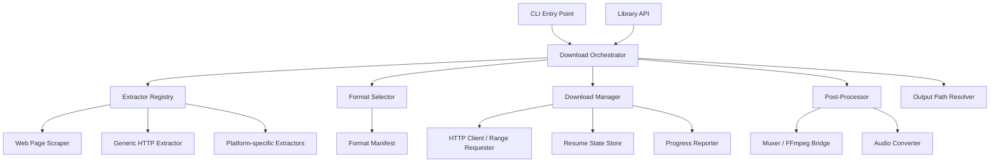
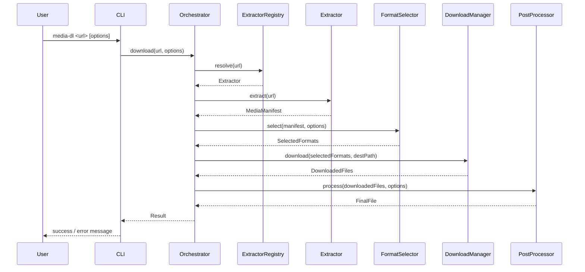
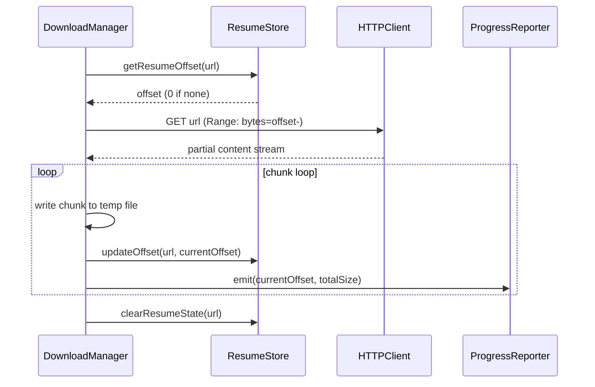

# Design Document: Media Downloader


## Overview

The media downloader is a CLI tool and reusable library for downloading video and audio files from internet sources (web pages, streaming platforms, direct media URLs). Given a URL, the tool identifies the media host, extracts available media streams and formats, selects the best match against user-specified quality constraints, downloads the stream(s), optionally merges video and audio tracks, and writes the final file to disk. The system is designed to be extensible: new platform extractors can be added without changing core download or merge logic.

The tool exposes both a command-line interface for end users and a programmatic API for integration into other applications. It supports resuming interrupted downloads, progress reporting, format selection, post-processing (audio extraction, remuxing), and configurable output naming. In addition to direct media URLs, the default extractor pipeline now includes a lightweight web scraper for static HTML pages that surfaces media links embedded in the page.

## Architecture



## Sequence Diagrams

### Main Download Flow



### Resumable Download Flow



## Components and Interfaces

### Component 1: Download Orchestrator

**Purpose**: Central coordinator. Drives the full pipeline from URL input to final file on disk.

**Interface**:
```math
\begin{aligned}
&\text{Orchestrator} : \{\\
&\quad \text{download} : \text{URL} \times \text{DownloadOptions} \rightarrow \text{Result}(\text{DownloadResult}, \text{DownloadError})\\
&\quad \text{downloadBatch} : \text{URL}^{*} \times \text{DownloadOptions} \rightarrow \text{Result}(\text{DownloadResult}, \text{DownloadError})^{*}\\
&\}
\end{aligned}
```

**Responsibilities**:
- Resolve the correct extractor for a given URL
- Coordinate extraction → format selection → download → post-processing
- Handle top-level error recovery and retries
- Emit lifecycle events (start, progress, complete, error)

---

### Component 2: Extractor Registry

**Purpose**: Maintains the ordered list of platform extractors and resolves which one handles a given URL.

**Interface**:
```math
\begin{aligned}
&\text{ExtractorRegistry} : \{\\
&\quad \text{register} : \text{Extractor} \rightarrow \text{Unit}\\
&\quad \text{resolve} : \text{URL} \rightarrow \text{Option}(\text{Extractor})\\
&\quad \text{extractors} : \text{Extractor}^{*}\\
&\}
\end{aligned}
```

**Responsibilities**:
- Match URLs against each extractor's `canHandle` predicate (in registration order)
- Return the first matching extractor, or `None` if no extractor matches
- Allow runtime registration of additional extractors (plugin model)

---

### Component 3: Extractor (per-platform)

**Purpose**: Fetches the page/API for a given URL and returns a structured `MediaManifest` describing all available streams and metadata.

The default implementation now includes a `WebPageExtractor` for static HTML pages. It uses lightweight parsing to discover embedded media URLs from tags such as `video`, `audio`, `source`, `img`, and anchor links, plus common metadata properties such as `og:image` and `og:video`.

**Interface**:
```math
\begin{aligned}
&\text{Extractor} : \{\\
&\quad \text{canHandle} : \text{URL} \rightarrow \mathbb{B}\\
&\quad \text{extract} : \text{URL} \rightarrow \text{Result}(\text{MediaManifest}, \text{ExtractionError})\\
&\}
\end{aligned}
```

**Responsibilities**:
- Determine if a URL belongs to its platform (pattern matching)
- Fetch and parse the page or platform API
- Build and return a `MediaManifest` with all format streams

---

### Component 4: Format Selector

**Purpose**: Given a `MediaManifest` and user quality preferences, returns the optimal set of streams to download.

**Interface**:
```math
\begin{aligned}
&\text{FormatSelector} : \{\\
&\quad \text{select} : \text{MediaManifest} \times \text{FormatOptions} \rightarrow \text{Result}(\text{SelectedFormats}, \text{SelectionError})\\
&\}
\end{aligned}
```

**Responsibilities**:
- Filter streams by type (video, audio, combined)
- Score streams against quality constraints (resolution, bitrate, codec preferences)
- Decide whether separate video+audio streams are needed (requires mux)
- Return selected stream(s) for download

---

### Component 5: Download Manager

**Purpose**: Performs the actual HTTP download of one or more stream URLs, with support for resuming, chunked transfer, and progress reporting.

**Interface**:
```math
\begin{aligned}
&\text{DownloadManager} : \{\\
&\quad \text{download} : \text{SelectedFormats} \times \text{Path} \rightarrow \text{Result}(\text{DownloadedFiles}, \text{DownloadError})\\
&\quad \text{cancel} : \text{Unit} \rightarrow \text{Unit}\\
&\}
\end{aligned}
```

**Responsibilities**:
- Issue HTTP range requests to support resume
- Persist resume state (byte offset) across restarts
- Write chunks to a temporary file and rename on completion
- Fire progress events for each chunk written

---

### Component 6: Post-Processor

**Purpose**: Transforms downloaded raw files into the final output (mux video+audio, extract audio, remux container).

**Interface**:
```math
\begin{aligned}
&\text{PostProcessor} : \{\\
&\quad \text{process} : \text{DownloadedFiles} \times \text{PostProcessOptions} \rightarrow \text{Result}(\text{FinalFile}, \text{ProcessingError})\\
&\}
\end{aligned}
```

**Responsibilities**:
- Detect whether muxing is needed (separate video + audio tracks)
- Invoke FFmpeg (or equivalent) for muxing/remuxing/conversion
- Clean up temporary files after processing
- Validate output file integrity

---

### Component 7: Output Path Resolver

**Purpose**: Converts a template string (e.g. `%(title)s.%(ext)s`) and `MediaManifest` metadata into a concrete file path.

**Interface**:
```math
\begin{aligned}
&\text{OutputPathResolver} : \{\\
&\quad \text{resolve} : \text{OutputTemplate} \times \text{MediaManifest} \rightarrow \text{Path}\\
&\}
\end{aligned}
```

**Responsibilities**:
- Substitute template variables with metadata fields
- Sanitize resulting filename for the target OS
- Ensure no path collisions (append index if needed)

## Data Models

### Model 1: MediaManifest

Represents all available streams and metadata extracted from a URL.

```math
\begin{aligned}
&\text{MediaManifest} = \{\\
&\quad \text{id} : \text{String},\\
&\quad \text{title} : \text{String},\\
&\quad \text{description} : \text{Option}(\text{String}),\\
&\quad \text{uploader} : \text{Option}(\text{String}),\\
&\quad \text{duration} : \text{Option}(\mathbb{N}), \quad \text{// seconds}\\
&\quad \text{thumbnail} : \text{Option}(\text{URL}),\\
&\quad \text{formats} : \text{Format}^{+}, \quad \text{// non-empty list}\\
&\quad \text{extractedAt} : \text{Timestamp}\\
&\}
\end{aligned}
```

**Validation Rules**:
- `id` must be non-empty
- `formats` must contain at least one element
- `duration` must be positive if present

---

### Model 2: Format

Describes a single downloadable stream.

```math
\begin{aligned}
&\text{Format} = \{\\
&\quad \text{formatId} : \text{String},\\
&\quad \text{url} : \text{URL},\\
&\quad \text{streamType} : \text{StreamType}, \quad \text{StreamType} = \text{VideoOnly} | \text{AudioOnly} | \text{Combined}\\
&\quad \text{container} : \text{String}, \quad \text{// e.g. "mp4", "webm", "m4a"}\\
&\quad \text{codec} : \text{Option}(\text{String}),\\
&\quad \text{width} : \text{Option}(\mathbb{N}),\\
&\quad \text{height} : \text{Option}(\mathbb{N}),\\
&\quad \text{fps} : \text{Option}(\mathbb{R}),\\
&\quad \text{audioBitrate} : \text{Option}(\mathbb{N}), \quad \text{// kbps}\\
&\quad \text{videoBitrate} : \text{Option}(\mathbb{N}), \quad \text{// kbps}\\
&\quad \text{fileSize} : \text{Option}(\mathbb{N}), \quad \text{// bytes}\\
&\quad \text{isHLS} : \mathbb{B},\\
&\quad \text{isDASH} : \mathbb{B}\\
&\}
\end{aligned}
```

---

### Model 3: DownloadOptions

User-supplied configuration for a download request.

```math
\begin{aligned}
&\text{DownloadOptions} = \{\\
&\quad \text{quality} : \text{QualitySpec}, \quad \text{QualitySpec} = \text{Best} | \text{Worst} | \text{Height}(\mathbb{N}) | \text{FormatId}(\text{String})\\
&\quad \text{audioOnly} : \mathbb{B},\\
&\quad \text{audioFormat} : \text{Option}(\text{String}), \quad \text{// e.g. "mp3", "m4a"}\\
&\quad \text{outputTemplate} : \text{OutputTemplate},\\
&\quad \text{outputDir} : \text{Path},\\
&\quad \text{rateLimit} : \text{Option}(\mathbb{N}), \quad \text{// bytes/sec}\\
&\quad \text{retries} : \mathbb{N},\\
&\quad \text{resume} : \mathbb{B},\\
&\quad \text{concurrentFragments} : \mathbb{N}\\
&\}
\end{aligned}
```

---

### Model 4: SelectedFormats

The result of format selection — what will actually be downloaded.

```math
\begin{aligned}
&\text{SelectedFormats} = \{\\
&\quad \text{video} : \text{Option}(\text{Format}),\\
&\quad \text{audio} : \text{Option}(\text{Format}),\\
&\quad \text{requiresMux} : \mathbb{B} \quad \text{// true iff video} \neq \emptyset \land \text{audio} \neq \emptyset\\
&\}
\end{aligned}
```

**Invariant**: $\text{requiresMux} = (\text{video} \neq \emptyset \land \text{audio} \neq \emptyset)$

---

### Model 5: DownloadResult

Final outcome of a completed download operation.

```math
\begin{aligned}
&\text{DownloadResult} = \{\\
&\quad \text{finalPath} : \text{Path},\\
&\quad \text{manifest} : \text{MediaManifest},\\
&\quad \text{selectedFormats} : \text{SelectedFormats},\\
&\quad \text{bytesDownloaded} : \mathbb{N},\\
&\quad \text{durationMs} : \mathbb{N}\\
&\}
\end{aligned}
```

---

### Model 6: ResumeState

Persisted state enabling interrupted downloads to continue.

```math
\begin{aligned}
&\text{ResumeState} = \{\\
&\quad \text{url} : \text{URL},\\
&\quad \text{tempPath} : \text{Path},\\
&\quad \text{bytesWritten} : \mathbb{N},\\
&\quad \text{totalSize} : \text{Option}(\mathbb{N}),\\
&\quad \text{etag} : \text{Option}(\text{String}),\\
&\quad \text{lastModified} : \text{Option}(\text{Timestamp})\\
&\}
\end{aligned}
```

## Algorithmic Pseudocode

### Algorithm 1: Main Download Orchestration

```math
\begin{aligned}
&\textbf{algorithm } \text{orchestrate} \textbf{ is}\\
&\quad \textbf{input}: u \in \text{URL},\ opts \in \text{DownloadOptions}\\
&\quad \textbf{output}: r \in \text{Result}(\text{DownloadResult}, \text{DownloadError})\\
&\quad \textbf{precondition}: u \neq \emptyset \land \text{isValidURL}(u)\\
&\quad \textbf{postcondition}: r = \text{Ok}(d) \Rightarrow \text{fileExists}(d.\text{finalPath}) \land d.\text{bytesDownloaded} > 0\\
&\\
&\quad \text{extractor} \gets \text{registry.resolve}(u)\\
&\quad \textbf{if } \text{extractor} = \emptyset \textbf{ then return } \text{Err}(\text{NoExtractorFound}(u))\\
&\\
&\quad \text{manifest} \gets \text{extractor.extract}(u)\\
&\quad \textbf{if } \text{manifest} = \text{Err}(e) \textbf{ then return } \text{Err}(\text{ExtractionFailed}(e))\\
&\\
&\quad \text{selected} \gets \text{formatSelector.select}(\text{manifest.value}, opts)\\
&\quad \textbf{if } \text{selected} = \text{Err}(e) \textbf{ then return } \text{Err}(\text{SelectionFailed}(e))\\
&\\
&\quad \text{destDir} \gets \text{outputResolver.resolve}(opts.\text{outputTemplate}, \text{manifest.value})\\
&\\
&\quad \text{files} \gets \text{downloadManager.download}(\text{selected.value}, \text{destDir})\\
&\quad \textbf{if } \text{files} = \text{Err}(e) \textbf{ then return } \text{Err}(\text{DownloadFailed}(e))\\
&\\
&\quad \text{final} \gets \text{postProcessor.process}(\text{files.value}, \text{toPostProcOpts}(opts))\\
&\quad \textbf{if } \text{final} = \text{Err}(e) \textbf{ then return } \text{Err}(\text{ProcessingFailed}(e))\\
&\\
&\quad \textbf{return } \text{Ok}\Bigl(\{\\
&\quad\quad \text{finalPath}: \text{final.value.path},\ \text{manifest}: \text{manifest.value},\\
&\quad\quad \text{selectedFormats}: \text{selected.value},\ \text{bytesDownloaded}: \text{files.value.totalBytes},\\
&\quad\quad \text{durationMs}: \text{elapsed}()\\
&\quad \}\Bigr)
\end{aligned}
```

**Preconditions**:
- $u$ is a syntactically valid URL
- `registry` contains at least one registered extractor

**Postconditions**:
- On success: output file exists at `finalPath` with non-zero size
- On failure: no partial files are left in the output directory (cleaned up)

---

### Algorithm 2: Format Selection

```math
\begin{aligned}
&\textbf{algorithm } \text{selectFormats} \textbf{ is}\\
&\quad \textbf{input}: m \in \text{MediaManifest},\ opts \in \text{FormatOptions}\\
&\quad \textbf{output}: s \in \text{Result}(\text{SelectedFormats}, \text{SelectionError})\\
&\quad \textbf{precondition}: m.\text{formats} \neq \emptyset\\
&\quad \textbf{postcondition}: s = \text{Ok}(f) \Rightarrow (f.\text{video} \neq \emptyset \lor f.\text{audio} \neq \emptyset)\\
&\\
&\quad \textbf{if } opts.\text{formatId} \neq \emptyset \textbf{ then}\\
&\quad\quad f \gets m.\text{formats}[\text{opts.formatId}]\\
&\quad\quad \textbf{if } f = \emptyset \textbf{ then return } \text{Err}(\text{FormatIdNotFound})\\
&\quad\quad \textbf{return } \text{Ok}(\text{asSingleFormat}(f))\\
&\quad \textbf{end if}\\
&\\
&\quad \text{candidates} \gets \{ f \in m.\text{formats} \mid \text{matchesConstraints}(f, opts) \}\\
&\\
&\quad \textbf{if } opts.\text{audioOnly} \textbf{ then}\\
&\quad\quad \text{best} \gets \arg\max_{f \in \text{candidates},\ f.\text{streamType} \in \{\text{AudioOnly}, \text{Combined}\}} \text{audioScore}(f)\\
&\quad\quad \textbf{return } \text{Ok}(\{ \text{video}: \emptyset,\ \text{audio}: \text{best},\ \text{requiresMux}: \bot \})\\
&\quad \textbf{end if}\\
&\\
&\quad \text{combined} \gets \{ f \in \text{candidates} \mid f.\text{streamType} = \text{Combined} \}\\
&\quad \text{videoOnly} \gets \{ f \in \text{candidates} \mid f.\text{streamType} = \text{VideoOnly} \}\\
&\quad \text{audioOnly\_} \gets \{ f \in \text{candidates} \mid f.\text{streamType} = \text{AudioOnly} \}\\
&\\
&\quad \textbf{if } \text{combined} \neq \emptyset \textbf{ then}\\
&\quad\quad \text{best} \gets \arg\max_{f \in \text{combined}} \text{qualityScore}(f, opts)\\
&\quad\quad \textbf{return } \text{Ok}(\{ \text{video}: \text{best},\ \text{audio}: \emptyset,\ \text{requiresMux}: \bot \})\\
&\quad \textbf{else if } \text{videoOnly} \neq \emptyset \land \text{audioOnly\_} \neq \emptyset \textbf{ then}\\
&\quad\quad v \gets \arg\max_{f \in \text{videoOnly}} \text{videoScore}(f, opts)\\
&\quad\quad a \gets \arg\max_{f \in \text{audioOnly\_}} \text{audioScore}(f)\\
&\quad\quad \textbf{return } \text{Ok}(\{ \text{video}: v,\ \text{audio}: a,\ \text{requiresMux}: \top \})\\
&\quad \textbf{else}\\
&\quad\quad \textbf{return } \text{Err}(\text{NoSuitableFormatFound})\\
&\quad \textbf{end if}
\end{aligned}
```

**Preconditions**:
- $m.\text{formats} \neq \emptyset$
- $opts.\text{quality} \in \{\text{Best}, \text{Worst}, \text{Height}(n), \text{FormatId}(s)\}$

**Postconditions**:
- At least one of `video` or `audio` is non-empty in the result
- `requiresMux = true` iff both `video` and `audio` are present

---

### Algorithm 3: Resumable HTTP Download

```math
\begin{aligned}
&\textbf{algorithm } \text{downloadStream} \textbf{ is}\\
&\quad \textbf{input}: u \in \text{URL},\ \text{dest} \in \text{Path},\ opts \in \text{DownloadOptions}\\
&\quad \textbf{output}: r \in \text{Result}(\text{DownloadedFile}, \text{DownloadError})\\
&\quad \textbf{precondition}: u \neq \emptyset \land \text{isAccessible}(\text{dest.parent})\\
&\quad \textbf{postcondition}: r = \text{Ok}(f) \Rightarrow f.\text{size} = \text{totalSize} \land \text{fileIntact}(f.\text{path})\\
&\\
&\quad \text{offset} \gets \textbf{if } opts.\text{resume} \textbf{ then } \text{resumeStore.get}(u).\text{bytesWritten} \textbf{ else } 0\\
&\quad \text{resp} \gets \text{http.get}(u, \text{headers}: \{\text{"Range"}: \text{"bytes="\!+\!offset\!+\!"-"}\})\\
&\quad \textbf{if } \text{resp.status} \notin \{200, 206\} \textbf{ then return } \text{Err}(\text{HTTPError}(\text{resp.status}))\\
&\\
&\quad \text{totalSize} \gets \text{parseContentLength}(\text{resp.headers}) + \text{offset}\\
&\quad \text{tempPath} \gets \text{dest} + \text{".part"}\\
&\quad \text{file} \gets \text{openAppend}(\text{tempPath})\\
&\\
&\quad \text{written} \gets \text{offset}\\
&\quad \textbf{for each } \text{chunk} \in \text{resp.bodyChunks} \textbf{ do}\\
&\quad\quad \quad \textbf{invariant}: \text{written} \leq \text{totalSize} \land \text{fileConsistent}(\text{tempPath}, \text{written})\\
&\quad\quad \text{applyRateLimit}(opts.\text{rateLimit})\\
&\quad\quad \text{file.write}(\text{chunk})\\
&\quad\quad \text{written} \gets \text{written} + |\text{chunk}|\\
&\quad\quad \text{resumeStore.update}(u, \text{written})\\
&\quad\quad \text{progress.emit}(\text{written}, \text{totalSize})\\
&\quad \textbf{end for}\\
&\\
&\quad \text{file.close}()\\
&\quad \text{rename}(\text{tempPath}, \text{dest})\\
&\quad \text{resumeStore.clear}(u)\\
&\quad \textbf{return } \text{Ok}(\{ \text{path}: \text{dest},\ \text{size}: \text{written} \})
\end{aligned}
```

**Preconditions**:
- The URL is reachable and responds with HTTP 200 or 206
- The destination parent directory exists and is writable

**Postconditions**:
- On success: `.part` temp file is removed; final file size equals `totalSize`
- Resume state is cleared upon successful completion

**Loop Invariant**:
- $\text{written} \leq \text{totalSize}$
- The `.part` file on disk is byte-for-byte consistent with the first `written` bytes of the stream

---

### Algorithm 4: URL Extractor Resolution

```math
\begin{aligned}
&\textbf{algorithm } \text{resolveExtractor} \textbf{ is}\\
&\quad \textbf{input}: u \in \text{URL},\ E = [e_1, e_2, \ldots, e_n] \in \text{Extractor}^{*}\\
&\quad \textbf{output}: x \in \text{Option}(\text{Extractor})\\
&\quad \textbf{precondition}: u \neq \emptyset\\
&\quad \textbf{postcondition}: x = \text{Some}(e) \Rightarrow e.\text{canHandle}(u) = \top\\
&\\
&\quad i \gets 1\\
&\quad \textbf{while } i \leq n \textbf{ do}\\
&\quad\quad \textbf{invariant}: \forall j < i,\ e_j.\text{canHandle}(u) = \bot\\
&\quad\quad \textbf{if } e_i.\text{canHandle}(u) \textbf{ then return } \text{Some}(e_i)\\
&\quad\quad i \gets i + 1\\
&\quad \textbf{end while}\\
&\quad \textbf{return } \text{None}
\end{aligned}
```

**Loop Invariant**: All extractors at indices $< i$ have been checked and do not handle $u$.

---

### Algorithm 5: Format Quality Scoring

```math
\begin{aligned}
&\textbf{algorithm } \text{qualityScore} \textbf{ is}\\
&\quad \textbf{input}: f \in \text{Format},\ opts \in \text{FormatOptions}\\
&\quad \textbf{output}: s \in \mathbb{R}\\
&\quad \textbf{precondition}: f \neq \emptyset\\
&\\
&\quad h \gets f.\text{height} \text{ if } f.\text{height} \neq \emptyset \text{ else } 0\\
&\quad vb \gets f.\text{videoBitrate} \text{ if } f.\text{videoBitrate} \neq \emptyset \text{ else } 0\\
&\quad ab \gets f.\text{audioBitrate} \text{ if } f.\text{audioBitrate} \neq \emptyset \text{ else } 0\\
&\\
&\quad \textbf{match } opts.\text{quality} \textbf{ with}\\
&\quad | \text{Best} \Rightarrow s \gets h \times 10000 + vb + ab\\
&\quad | \text{Worst} \Rightarrow s \gets -(h \times 10000 + vb + ab)\\
&\quad | \text{Height}(target) \Rightarrow s \gets -|h - target|\\
&\quad \textbf{return } s
\end{aligned}
```

## Key Functions with Formal Specifications

### Function 1: `extract(url)`

```math
\text{extract} : \text{URL} \rightarrow \text{Result}(\text{MediaManifest}, \text{ExtractionError})
```

**Preconditions**:
- $url \neq \emptyset$
- Network is reachable; the platform at $url$ is accessible

**Postconditions**:
- $\text{Ok}(m) \Rightarrow m.\text{formats} \neq \emptyset \land m.\text{id} \neq \emptyset$
- $\text{Err}(e) \Rightarrow e \in \{\text{NetworkError}, \text{ParseError}, \text{GeoBlocked}, \text{NotFound}\}$

---

### Function 2: `select(manifest, opts)`

```math
\text{select} : \text{MediaManifest} \times \text{FormatOptions} \rightarrow \text{Result}(\text{SelectedFormats}, \text{SelectionError})
```

**Preconditions**:
- $manifest.\text{formats} \neq \emptyset$
- $opts.\text{quality} \in \text{QualitySpec}$

**Postconditions**:
- $\text{Ok}(s) \Rightarrow (s.\text{video} \neq \emptyset \lor s.\text{audio} \neq \emptyset)$
- $\text{Ok}(s) \Rightarrow s.\text{requiresMux} = (s.\text{video} \neq \emptyset \land s.\text{audio} \neq \emptyset)$
- $\text{Err}(e) \Rightarrow \text{no format in manifest satisfies constraints}$

---

### Function 3: `download(selectedFormats, dest)`

```math
\text{download} : \text{SelectedFormats} \times \text{Path} \rightarrow \text{Result}(\text{DownloadedFiles}, \text{DownloadError})
```

**Preconditions**:
- At least one of `selectedFormats.video` or `selectedFormats.audio` is non-empty
- `dest` directory is writable

**Postconditions**:
- $\text{Ok}(files) \Rightarrow \forall f \in files,\ \text{fileExists}(f.\text{path}) \land f.\text{size} > 0$
- On failure: all temporary `.part` files are cleaned up

**Loop Invariant** (chunk write loop):
- `written ≤ totalSize`
- The `.part` file on disk matches the first `written` bytes of the remote stream

---

### Function 4: `process(files, opts)`

```math
\text{process} : \text{DownloadedFiles} \times \text{PostProcessOptions} \rightarrow \text{Result}(\text{FinalFile}, \text{ProcessingError})
```

**Preconditions**:
- All files in `DownloadedFiles` exist and have non-zero size
- FFmpeg is available if `requiresMux = true`

**Postconditions**:
- $\text{Ok}(f) \Rightarrow \text{fileExists}(f.\text{path}) \land \text{validMediaFile}(f.\text{path})$
- Intermediate downloaded files are deleted after successful mux
- On failure: original downloaded files are preserved (no data loss)

---

### Function 5: `resolve(template, manifest)`

```math
\text{resolve} : \text{OutputTemplate} \times \text{MediaManifest} \rightarrow \text{Path}
```

**Preconditions**:
- `template` is a non-empty string
- `manifest` contains all fields referenced in `template`

**Postconditions**:
- Returned path has no illegal filesystem characters
- Returned path is unique within the output directory

## Example Usage

```math
\begin{aligned}
&\textbf{// Basic video download}\\
&\textbf{let } u = \text{"https://example-video-site.com/watch?v=abc123"}\\
&\textbf{let } opts = \{\\
&\quad \text{quality}: \text{Best},\ \text{audioOnly}: \bot,\ \text{audioFormat}: \emptyset,\\
&\quad \text{outputTemplate}: \text{"%(title)s.%(ext)s"},\ \text{outputDir}: \text{"./downloads"},\\
&\quad \text{retries}: 3,\ \text{resume}: \top,\ \text{concurrentFragments}: 4\\
&\}\\
&\textbf{let } r = \text{orchestrator.download}(u, opts)\\
&\textbf{match } r \textbf{ with}\\
&\quad | \text{Ok}(d) \rightarrow \text{print}(\text{"Saved to: "} + d.\text{finalPath})\\
&\quad | \text{Err}(e) \rightarrow \text{print}(\text{"Error: "} + e.\text{message})\\
&\\
&\textbf{// Audio-only extraction}\\
&\textbf{let } opts_a = opts \cup \{ \text{audioOnly}: \top,\ \text{audioFormat}: \text{"mp3"} \}\\
&\textbf{let } r_a = \text{orchestrator.download}(u, opts_a)\\
&\\
&\textbf{// Specific quality}\\
&\textbf{let } opts_q = opts \cup \{ \text{quality}: \text{Height}(1080) \}\\
&\textbf{let } r_q = \text{orchestrator.download}(u, opts_q)\\
&\\
&\textbf{// Batch download}\\
&\textbf{let } urls = [u_1, u_2, u_3]\\
&\textbf{let } results = \text{orchestrator.downloadBatch}(urls, opts)\\
&\forall i,\ results[i] = \text{Ok}(\cdot) \lor results[i] = \text{Err}(\cdot) \quad \textbf{// each independent}
\end{aligned}
```

## Correctness Properties

```math
\begin{aligned}
&\textbf{P1 (Format Non-empty):}\\
&\quad \forall u \in \text{URL},\ \text{extract}(u) = \text{Ok}(m) \Rightarrow |m.\text{formats}| \geq 1\\
&\\
&\textbf{P2 (Mux Consistency):}\\
&\quad \forall m \in \text{MediaManifest},\ opts \in \text{FormatOptions},\\
&\quad \text{select}(m, opts) = \text{Ok}(s) \Rightarrow\\
&\quad\quad s.\text{requiresMux} \iff (s.\text{video} \neq \emptyset \land s.\text{audio} \neq \emptyset)\\
&\\
&\textbf{P3 (Download Completeness):}\\
&\quad \forall u,\ \text{downloadStream}(u, \cdot, \cdot) = \text{Ok}(f) \Rightarrow f.\text{size} = \text{remoteSize}(u)\\
&\\
&\textbf{P4 (Resume Correctness):}\\
&\quad \forall u,\ \text{resumeStore.get}(u) = \{ \text{bytesWritten}: k \}\\
&\quad \Rightarrow \text{downloadStream}(u, \text{opts} \cup \{ \text{resume}: \top \}) \text{ starts from byte } k\\
&\\
&\textbf{P5 (No Partial Output):}\\
&\quad \text{download fails} \Rightarrow \text{no file at finalPath exists in output directory}\\
&\\
&\textbf{P6 (Idempotent Format Selection):}\\
&\quad \forall m, opts,\ \text{select}(m, opts) = \text{select}(m, opts) \quad \textbf{// deterministic}\\
&\\
&\textbf{P7 (Extractor Resolution Consistency):}\\
&\quad \forall u \in \text{URL},\ e \in \text{Extractor},\\
&\quad \text{resolve}(u) = \text{Some}(e) \Rightarrow e.\text{canHandle}(u) = \top\\
&\\
&\textbf{P8 (Output Path Safety):}\\
&\quad \forall t \in \text{OutputTemplate},\ m \in \text{MediaManifest},\\
&\quad \text{resolve}(t, m).\text{filename} \text{ contains no illegal filesystem characters}\\
&\\
&\textbf{P9 (Rate Limit Respect):}\\
&\quad opts.\text{rateLimit} = \text{Some}(r) \Rightarrow \text{avgThroughput}(\text{download}) \leq r \text{ bytes/sec}
\end{aligned}
```

## Error Handling

### Error Scenario 1: No Extractor Found

**Condition**: The URL does not match any registered extractor's `canHandle` predicate.
**Response**: Return `Err(NoExtractorFound(url))` immediately; do not attempt any network request.
**Recovery**: User should supply a direct media URL, or a custom extractor can be registered.

---

### Error Scenario 2: Extraction Failure

**Condition**: The extractor fetches the page but cannot parse the media manifest (page structure changed, geo-blocked, login required, rate-limited by the platform).
**Response**: Return `Err(ExtractionFailed(reason))` with a descriptive cause.
**Recovery**: Retry up to `opts.retries` times with exponential backoff for transient errors (network timeout, 429 Too Many Requests). Permanent errors (geo-block, login wall) are surfaced without retry.

---

### Error Scenario 3: No Suitable Format

**Condition**: `FormatSelector` cannot find a format satisfying the user's quality constraints (e.g., `Height(2160)` but only 1080p is available).
**Response**: Return `Err(NoSuitableFormatFound)` with a list of available heights.
**Recovery**: Relax quality constraints — fall back to `Best` available. Surfaced as a warning with the actual quality chosen.

---

### Error Scenario 4: Download Interruption

**Condition**: Network drops mid-download.
**Response**: The chunk loop exits; `ResumeState` is flushed to disk with the current byte offset. The `.part` file is preserved.
**Recovery**: On next invocation with `resume: true`, the download resumes from the saved offset. If the server does not support range requests (no `Accept-Ranges: bytes` header), the download restarts from byte 0 with a warning.

---

### Error Scenario 5: Post-Processing Failure

**Condition**: FFmpeg exits with a non-zero code during mux/conversion.
**Response**: Return `Err(ProcessingFailed(ffmpegOutput))` including the FFmpeg stderr.
**Recovery**: The raw downloaded files are preserved so the user can manually mux. A retry with a different output container may succeed.

---

### Error Scenario 6: Disk Full

**Condition**: Write to the `.part` file fails due to insufficient disk space.
**Response**: Close the file, return `Err(DiskFull(path))`.
**Recovery**: The `.part` file is kept; the user can free space and resume the download.

## Testing Strategy

### Unit Testing Approach

Each component is tested in isolation with mocked dependencies:

- **ExtractorRegistry**: Verify correct extractor is returned for known URL patterns; verify `None` for unrecognized URLs.
- **FormatSelector**: Test all `QualitySpec` variants, audio-only mode, mux decision, empty format list edge case.
- **OutputPathResolver**: Test template substitution, illegal character sanitization, collision avoidance.
- **ResumeState persistence**: Test read/write/clear of resume state records.

Coverage goal: ≥ 90% branch coverage on core logic modules.

### Property-Based Testing Approach

**Property Test Library**: fast-check (JavaScript/TypeScript), Hypothesis (Python), or QuickCheck (Haskell) — depending on implementation language.

Key properties to generate:

```math
\begin{aligned}
&\forall m \in \text{arbitrary}(\text{MediaManifest}),\ opts \in \text{arbitrary}(\text{FormatOptions}):\\
&\quad \text{select}(m, opts) = \text{Ok}(s) \Rightarrow s.\text{requiresMux} \iff (s.\text{video} \neq \emptyset \land s.\text{audio} \neq \emptyset)\\
&\\
&\forall t \in \text{arbitrary}(\text{String}),\ m \in \text{arbitrary}(\text{MediaManifest}):\\
&\quad \text{resolve}(t, m) \text{ contains no characters in ILLEGAL\_CHARS}\\
&\\
&\forall k \in [0, n],\ \text{offset } k \text{ stored in resume state}:\\
&\quad \text{download resumes exactly from byte } k
\end{aligned}
```

### Integration Testing Approach

- **End-to-end with a local HTTP test server**: Serve static video/audio files; verify the full pipeline produces a playable output file.
- **Resume integration test**: Kill the download at 50% bytes; restart; verify final file equals full file.
- **Batch download test**: Download 3 URLs concurrently; verify all succeed independently.
- **FFmpeg mux test**: Supply pre-downloaded separate video and audio fragments; verify muxed output is a valid container.

## Performance Considerations

- **Concurrent fragment download**: HLS/DASH streams are split into fragments; `concurrentFragments` controls parallelism (default: 4). Each fragment is downloaded on a separate worker; results are assembled in order.
- **Rate limiting**: A token-bucket implementation caps throughput to `opts.rateLimit` bytes/sec across all concurrent fragment downloads, not per-fragment.
- **Memory usage**: Chunks are written directly to disk; no full file is buffered in memory. Chunk size defaults to 1 MB.
- **Extractor caching**: Extracted `MediaManifest` results can be cached in-process (TTL: 60 s) to avoid redundant page fetches when retrying format selection.

## Security Considerations

- **URL validation**: All URLs are validated against a strict allowlist of schemes (`https`, `http`) before any network request. No `file://`, `data://`, or other schemes are accepted.
- **Filename sanitization**: Output paths are sanitized to prevent path traversal (e.g., `../` components stripped, null bytes rejected).
- **Shell injection**: FFmpeg and other external processes are invoked via argument arrays — never via shell string interpolation — to prevent command injection through malicious media metadata.
- **TLS verification**: HTTPS certificate verification is enabled by default. A `--no-check-certificate` flag may be exposed for development use only, with a visible warning.
- **Cookie / credential handling**: If platform authentication requires cookies, they are read from a file (never logged or serialized into error messages). Credential values are never printed in progress output.
- **Redirect limits**: HTTP redirects are followed up to a configurable maximum (default: 10) to prevent redirect loops.

## Dependencies

| Dependency | Purpose |
|---|---|
| HTTP client library | Performing range-request downloads with streaming support |
| FFmpeg (external binary) | Muxing separate video+audio streams, audio conversion |
| URL parser | Validating and normalizing input URLs |
| Template engine / string formatter | Output filename template substitution |
| Resume state store | Persisting byte offsets across process restarts (e.g. JSON file or SQLite) |
| Progress reporter | Emitting download progress events (bytes, ETA, speed) |
| CLI argument parser | Parsing command-line flags and options |
